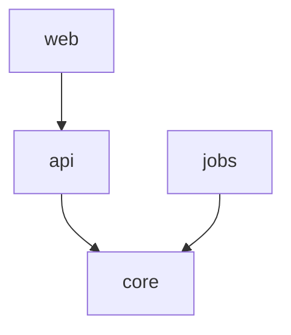

# Zoom Levels — Evidence Collection & Rendering

Per-level collection strategy and text rendering formats. Match the rendering to what the level must show; the paradigm-scale principle applies: module-level relations read best as matrices/graphs, functionality reads best as ordered chains.

## Macro — System Topology

**Collect:**

Adapt import syntax to the language (see language rule below).

0. **Language rule:** use the repo's import syntax for scans. JS/TS: `from './x'`; Python: `import x` / `from x import`; Rust: `use x::`; Go: `go list -deps`; Java: `import x.y;`. If the repo is multi-language, run the scan per language.
1. Top-level directory layout (`ls`, tree to depth 1–2). Identify likely module boundaries (packages, workspaces, domains). Exclude vendored/generated code (`node_modules`, `dist`, `target`, `vendor`, generated committed sources) from all counts — `rg` respects `.gitignore` by default, but generated-but-committed code must be excluded with explicit globs (`-g '!dist'`).
2. Inter-module imports: scan import statements crossing module boundaries. Quoting-safe scan (works in POSIX shells), e.g. JS/TS: `rg 'from ["'"'"']' --type js --type ts` or simply `rg 'import|require'`; then filter by path.
3. Count edges per pair of modules to get a weighted dependency list.
4. Determine layering for violation flags: use the repo's declared layering (README/ARCHITECTURE/docs) if present; otherwise infer it from the majority dependency direction and label that inference in the report.
5. **Weight & composition:** size each module by LOC (default) or file count (mixed-language repos, where LOC is not comparable across languages). Tool: `tokei` (or `cloc`); fallback: `rg --files <exclusion globs> | xargs wc -l`, summed per module. Two distinct metrics:
   - **Weight** (inventory column) — analysis code only, same exclusions as all counts (step 1).
   - **Composition** (report block) — disk reality: all code grouped by kind (source / test / generated / vendored / config), excluded code included. Works without modules too (flat/script repos): group by top-level directory or language.
   If neither tool nor fallback works, degrade to file-count-only weight and note it in the report.

**Render:**

Module inventory table:

| Module | Path | Responsibility (one line, from evidence) | Weight | Deps out → | Fan-in |
| :---- | :---- | :---- | :---- | :---- | :---- |

Weight bar: 10-cell `▓/░` bar proportional to the module's share of total weight, rounded to nearest cell, minimum 1 filled cell when weight > 0, followed by an integer percentage — e.g. `▓▓▓▓▓▓▓░░░ 67%`. Weight flags candidate targets for deeper levels; size ≠ complexity (a big cohesive module can be cheaper to map than a small hotspot).

Text dependency matrix (DSM-style). Rows depend on columns; mark `↑` for a dependency that skips a layer or points "backward" against the declared — or inferred (see collect step 4) — layering:

|  | core | api | web | jobs |
| :---- | :---- | :---- | :---- | :---- |
| core | — |  |  |  |
| api | ✦ | — |  |  |
| web | ✦ | ✦ | — |  |
| jobs | ✦ |  | ↑ | — |

Module graph (Mermaid), one node per module, edges labeled with edge counts:



**Facts to surface:** layering violations (↑ marks), cycles, hub modules (highest fan-in/out), orphan modules (zero fan-in), bulk distribution (largest modules by weight; share of total).

## Meso — Module / Feature Wiring

**Collect:**

1. Entry points of the module: exported symbols, route registrations, message handlers, CLI commands.
2. Internal components: classes/functions by responsibility; group by subdirectory.
3. Integration contracts: interfaces implemented, events published/consumed, external clients (HTTP, DB, queues).
4. Which other modules call in, and which the module calls out to.

**Render:**

Component table:

| Component | Path | Role | Talks to (internal) | External ports |
| :---- | :---- | :---- | :---- | :---- |

Wiring graph (Mermaid). Show direction and label edges with the mechanism (calls, publishes, reads):

```mermaid
graph LR
  routes --> service
  service --> repo
  service -- "publishes InvoicePaid" --> bus
  repo -- SQL --> [(db)]
```

**Facts to surface:** single points of fan-in, components with no callers, cross-boundary calls that bypass the module's public interface.

## Micro — Functionality Trace

**Collect:**

1. Locate the entry symbol (`rg "symbolName"`); read it fully.
2. Follow the call chain depth-first through the request's relevant path. Record each hop: `caller → callee (path:line)`.
3. Mark at each hop: pure logic, state mutation, I/O side effect (network, disk, DB, clock, randomness).

**Render:**

Ordered call chain:

```
1. POST /refunds        routes/payments.ts:42
2. refundInvoice()      services/refund.ts:17      [pure until step 4]
3. validateAmount()     domain/money.ts:88         [pure]
4. gateway.refund()     infra/stripe.ts:120        [I/O: network]
5. ledger.record()      infra/ledger.ts:55         [I/O: DB write]
6. bus.publish()        infra/events.ts:30         [I/O: queue]
```

Data flow list — what enters, how it transforms, what leaves:

```
RefundRequest{invoiceId, amount} → validated Amount → gateway response → LedgerEntry → InvoicePaid event
```

**Facts to surface:** where purity ends (first I/O hop), total hops, state mutated, error paths encountered (report; do not evaluate their quality).

Decision record: macro maps encode scale as a proportional weight bar in the inventory table (treemap area-encoding, phronemophobic "Treemaps are awesome!") plus a Composition block, not as literal treemap graphics — the vendored Mermaid v9.4.3 has no treemap diagram (v11.5+ is ESM-only, CORS-blocked under `file://`) and an ASCII treemap is less diff-able than the bar column. (treemap evaluation, 2026-09-05)
