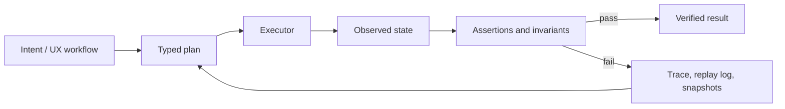
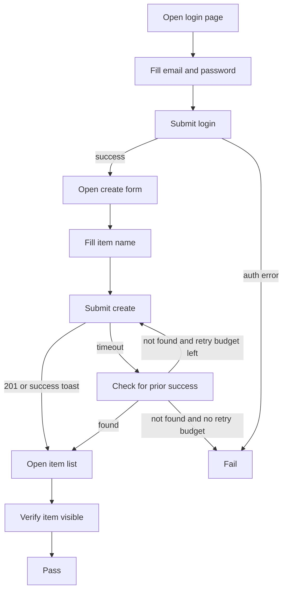
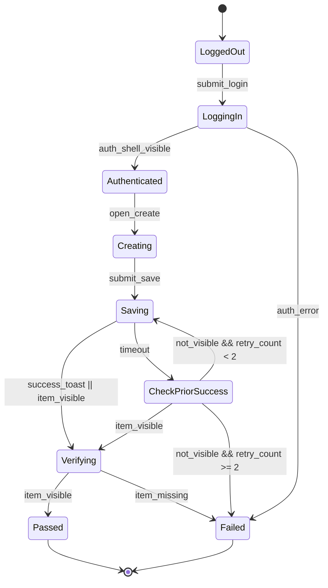

# UI Workflow Specifications for LLMs

## Executive summary

The most reliable way to describe UI interactions for LLM implementation is not to choose a single representation, but to use a **layered specification stack**: a human-readable task description for intent, a typed executable representation for actions and data, an explicit state model for branching and retries, and a verification harness that checks both behavior and safety. In practice, plain natural language is the best authoring surface for humans, but it is too underspecified to be the execution surface. The execution surface should usually be a constrained JSON/AST or DSL, with JSON Schema validation, explicit action semantics, and a state machine for non-trivial workflows. Prompt-layer structure in Markdown or XML is a strong front end for LLM comprehension, while JSON/AST and state machines are stronger back ends for enforcement. citeturn28view3turn36view0turn37view0turn14view0turn12search4

Robustness depends far more on **making hidden assumptions explicit** than on any particular prompt trick. The crucial fields are: action vocabulary, selector strategy and fallback order, preconditions, postconditions, timeout semantics, retry budgets, branching rules, state variables, and failure policy. Browser automation tools that are most reliable in practice all converge on this idea: use stable selectors, prefer user-facing semantics over brittle DOM paths, use built-in or explicit waits instead of fixed sleeps, and record traces or replay artifacts for diagnosis. Accessibility-based selectors are especially valuable because they align the spec with user-visible semantics rather than incidental markup structure. citeturn15view0turn15view2turn15view3turn31view3turn16view0turn16view1turn32search2turn32search1

A rigorous verification stack should be **layered as well**. Unit tests verify that the LLM emits valid plans and obeys invariants. Golden-file tests catch regression in planned steps. Property-based and stateful tests explore edge cases and action orderings. Contract tests stabilize API assumptions beneath the UI. Mocked integration tests isolate the workflow from external nondeterminism. Full end-to-end tests validate the whole stack. Formal methods are justified when the workflow is safety-critical, highly concurrent, or rich in branching and compensation logic. Model-in-the-loop evaluation is useful for broad coverage and regression tracking, but it should not be the only oracle for correctness. citeturn28view2turn22search0turn32search10turn38view0turn9search7turn38view1turn11search0turn11search3turn10search7turn10search2turn38view2turn38view3

For most teams, the best default architecture is:

1. **Author** the workflow in structured Markdown or XML.  
2. **Compile** it into a validated JSON plan or DSL.  
3. **Execute** it with a browser or RPA runtime that has explicit waiting, tracing, and mocking support.  
4. **Model** non-trivial branching as a state machine.  
5. **Verify** with assertions, mocks, snapshots, traces, and CI.  
6. **Evaluate** both task success and safety failure modes, including prompt injection, over-permissioned tool use, and unbounded loops. citeturn28view3turn36view0turn14view0turn15view2turn31view1turn32search2turn33view0turn33view1turn34view0

## Design criteria for good UI specs

A useful UI specification for LLMs has to do two jobs at once: it must be legible to a human reviewer and unambiguous enough for a machine executor. That is harder than it sounds because real UI tasks are dynamic, long-horizon, partially observable, and highly sensitive to timing and selector brittleness. Research benchmarks for web agents emphasize exactly these issues: urlWebArenaturn20search0 frames realistic tasks as long-horizon web interactions and includes programmatic validators; urlMind2Webturn20search1 argues that real websites are dynamic, noisy, and only partially observable; and urlBrowserGymturn20search2 was created because fragmented benchmarks and inconsistent evaluation methods made reliable comparison difficult. citeturn35view0turn35view1turn35view2

The consequence is that a UI spec should not only say **what** to do, but also define **what counts as completion**, **what evidence is acceptable**, and **what happens when the world is not in the expected state**. A good spec therefore needs at least these fields: objective, scope, allowed actions, selector policy, timing semantics, state variables, branching logic, error classes, retry policy, success criteria, and audit artifacts. At the lowest automation layer, the WebDriver standard itself is essentially a platform-neutral control protocol for discovering DOM elements and instructing browser behavior from an external process, which is why good high-level UI specs map naturally to typed action calls rather than free-form prose. citeturn15view4turn30view0

A useful mental model is to split the system into four artifacts: **intent**, **plan**, **execution**, and **evidence**.



This pipeline mirrors the distinction made in standards and tooling between declarative schemas, executable transitions, and validation or replay artifacts. JSON Schema formalizes constraints over instances, state-machine specs define transitions and retries, and tracing or recorder tools capture replayable evidence. citeturn36view0turn37view0turn14view0turn32search1turn32search2

The practical rule is simple: **anything that a reviewer might ask after a failure should be a first-class part of the spec before execution**. If a timeout, selector fallback, duplicate click, partial success, or retry path is left implicit, the LLM will infer it, and different runs or different models may infer different things. That is the core source of nondeterminism in LLM-driven UI automation. citeturn15view2turn15view3turn33view1

## Specification formats

The table below is a synthesis. The “enforceability” and “authoring cost” ratings are analytical judgments based on the cited standards, papers, and docs rather than directly reported benchmark numbers.

| Format | What it is best at | Enforceability | Authoring cost | Main weakness when used alone | Best production role | Representative sources |
|---|---|---:|---:|---|---|---|
| Natural-language checklist | Capturing user intent, business context, acceptance language | Low | Low | Ambiguous timing, selectors, and branching | Human review and top-level objective | citeturn35view0turn35view1turn28view3 |
| Structured prompt in Markdown or XML | Giving the LLM sectioned instructions, examples, and context | Medium | Low to medium | Still not a typed execution contract | Authoring front end for LLM planning | citeturn28view3turn29view1 |
| JSON/AST with JSON Schema | Typed actions, arguments, validation, storage, diffing | High | Medium | Verbose and less ergonomic for humans; poor long-context authoring format | Execution contract between planner and runner | citeturn36view0turn37view0turn28view1turn28view0turn29view0 |
| Dedicated DSL or keyword layer | Domain vocabulary, reuse, concise test authoring | High | Medium to high | Requires parser/runtime maintenance | Team-owned abstraction over common workflows | citeturn8search0turn31view0turn30view1 |
| State machine or statechart | Branching, retries, guards, loops, checkpoints, failure handling | Very high | Medium to high | Overkill for trivial linear tasks | Source of truth for non-trivial control flow | citeturn14view0turn12search0turn12search4turn12search1 |
| UX flow diagram plus contracts | Review, design communication, stakeholder alignment | Low by itself | Low | Not executable without attached assertions and selectors | Companion artifact for design review | citeturn32search1turn35view0 |

Several source-backed conclusions fall out of this comparison. First, for prompt authoring, structured Markdown or XML is usually a better surface than raw JSON. Prompt guidance from urlthe OpenAI prompt guidance docsturn17search1 recommends Markdown as a strong starting point and notes that XML performs well for structured nesting and long context, while JSON is highly structured but more verbose and performed poorly in their long-context testing. That makes Markdown or XML a good **authoring format**, but not the final execution contract. citeturn28view3

Second, JSON/AST becomes much more attractive once it is treated as an **intermediate representation** rather than the only specification humans touch. JSON Schema was designed for validation, documentation, and interaction control over JSON instances, and the newer structured-output and function-calling interfaces in urlthe OpenAI API docsturn17search5 explicitly use JSON Schema as the mechanism for constraining model outputs or tool arguments. urlLangChain structured output docsturn18search0 reflect the same pattern: the application asks for a schema, the runtime validates it, and the structured response lands in agent state. citeturn36view0turn37view0turn28view1turn28view0turn29view0

Third, DSLs earn their keep when the same workflow motifs recur. entity["software","Robot Framework","keyword-driven automation framework"] explicitly uses a keyword-driven approach for acceptance testing and RPA, and the entity["software","Selenium","browser automation framework"] docs encourage both page objects and even domain-specific or fluent APIs to separate test intent from page-specific locators and mechanics. That is exactly what a workflow DSL does for LLM implementations: it narrows the language of allowed plans. citeturn8search0turn31view0turn30view1

Fourth, state machines are the clearest way to represent workflow logic once there is real branching. The urlAmazon States Language specificationturn14view0 defines JSON-based declarative state machines with explicit states, transitions, terminal states, retries, and catch/fallback behavior. entity["software","XState","state machines and statecharts library"] describes the same core idea in application logic terms: finite states, guarded transitions, context, and deterministic next-state behavior for a given state-event pair. For LLM workflow specs, this is the most natural representation for retries, loops, compensation, and human approval checkpoints. citeturn14view0turn12search0turn12search4turn12search17

The strongest practical pattern is therefore a **dual representation**: write the human-facing spec in structured Markdown or XML, compile it into a JSON plan or DSL for execution, and attach a state machine when the workflow stops being linear. That keeps authoring ergonomic while preserving the determinism that tests and CI require. citeturn28view3turn36view0turn14view0

## Determinism and enforceability

Determinism starts with making step semantics explicit. Each step should declare its **operation**, **selector**, **arguments**, **preconditions**, **postconditions**, and **timeout semantics**. This is how modern automation tools are built. entity["software","Playwright","browser automation and testing framework"] treats locators as the central unit of retryability and resolves them fresh for each action; its actionability model waits until the target is visible, stable, event-receiving, and enabled before clicking. By contrast, Selenium exposes more of the waiting model directly and explicitly warns against mixing implicit and explicit waits because it can create unpredictable timeouts. citeturn15view0turn15view2turn15view3turn31view3

Selector policy is the first major enforceability decision. The clear best practice is to **prefer user-facing, accessibility-aligned selectors first**, then fall back only when necessary. Playwright recommends prioritizing explicit contracts and user-facing attributes such as role, label, text, alt text, title, and test id. That recommendation is not arbitrary: WAI-ARIA and the accessible-name computation specification define the semantic roles, names, and descriptions that user agents expose in the accessibility tree. In other words, a role/name selector is anchored in the same semantics real users and assistive technologies depend on, which usually makes it more stable than CSS or XPath that mirrors implementation detail. citeturn15view0turn16view0turn16view1

This leads to a practical selector precedence that works well in specs:

1. `role + accessible name`  
2. `label`  
3. `test id`  
4. `text`  
5. `css`  
6. `xpath`  

That order is a recommendation, not a universal law. If an application has a carefully curated `data-testid` contract and poor accessibility semantics, a team may choose test ids first. If this is not specified, it is **unspecified**, and the executor should not silently invent a priority order. citeturn15view0turn3search17

The next major choice is timing. Fixed sleeps are easy to write and hard to trust. Better specs define waits in terms of **observable conditions**: element visible, text present, request completed, toast hidden, route changed, row count increased, and so on. Playwright’s design moves a large fraction of this into actionability checks and web-first assertions. Selenium’s support libraries make the condition explicit with expected conditions and wait objects. The underlying lesson is the same in both systems: the spec should describe **what readiness means**, not how long to pause. citeturn15view2turn4search2turn31view3turn15view3

Assertions and invariants are where “specification” stops being narration and becomes enforcement. At the step level, every material action should have a postcondition. At the workflow level, invariants should hold throughout the run. Examples include: “cannot create an item while unauthenticated,” “at most one create request may succeed for a given idempotency key,” “retry count must remain below budget,” and “terminal success requires both UI confirmation and list visibility.” This style aligns with both runtime assertion systems and formal specification systems. entity["software","DSPy","declarative language model programming framework"] introduces assertions that can trigger retries or halt execution, while entity["software","TLA+","formal specification language"] and entity["software","Alloy","software modeling language and analyzer"] are explicitly built around checking invariants, temporal properties, or assertions over transition systems. citeturn29view3turn11search0turn11search3turn10search7turn10search2turn10search14

Retries need their own semantics. A retry is not just “try again”; it is a policy over **which errors are retryable**, **how many times**, **with what backoff**, and **whether the action is idempotent**. The Step Functions state language makes this very explicit with `Retry` and `Catch`, and it describes the order in which retriers and catchers are applied. If a UI workflow includes “Create item,” the spec should say whether a timeout after clicking “Save” may be retried, whether the client should first check for evidence of prior success, and what constitutes safe replay. Without that, a second click can turn a transient timeout into duplicated state. citeturn13search1turn14view0

Mocks, checkpoints, and replay logs are the other half of enforceability. Mocking reduces environmental nondeterminism, checkpoints make recovery explicit, and replay logs provide evidence. Playwright can intercept, modify, or fully mock HTTP traffic, including with HAR files; Trace Viewer captures action timelines, DOM snapshots, requests, responses, console data, and timing; Chrome DevTools Recorder can export and import user flows so exact reproductions can be shared and replayed; and Puppeteer Replay turns those Recorder exports into executable replay artifacts. These are not just debugging conveniences. They are part of the specification ecosystem because they define what can be re-run, audited, or compared after a failure. citeturn31view1turn31view2turn32search2turn32search4turn32search1turn32search3

| Enforcement primitive | What the spec should say | What it prevents | Representative sources |
|---|---|---|---|
| Typed action schema | Allowed ops, required args, enums, per-op constraints | Hallucinated actions and malformed plans | citeturn36view0turn37view0turn28view1turn28view0 |
| Stable selector policy | Preferred selector families and fallback order | Brittle DOM-coupled plans | citeturn15view0turn16view0turn16view1 |
| Observable waits | Visibility/text/network/route conditions, never raw sleep by default | Race conditions and flake | citeturn15view2turn15view3turn31view3 |
| Postconditions and invariants | Step-level assertions and workflow-wide safety properties | Silent partial failure and duplicate effects | citeturn29view3turn11search3turn10search14 |
| Retry and idempotency policy | Retryable errors, budget, backoff, compensation, idempotency guard | Double submits and runaway loops | citeturn13search1turn14view0turn33view1 |
| Mocks and fixtures | Which APIs or external services are stubbed and seeded | Environment drift | citeturn31view1turn31view2turn38view1 |
| Trace and replay artifacts | What trace, HAR, video, or recorder export is retained | Irreproducible failures | citeturn32search2turn32search1turn32search3turn4search0 |

## Verification strategies and tooling

Verification should be staged, not monolithic. The cheapest checks should run earliest, and the most expensive checks should run latest. In a strong pipeline, malformed plans never reach the browser, flaky network dependencies are neutralized before E2E, and risky workflows are evaluated for both task completion and misuse. This “funnel” structure is also how modern LLM eval tooling is documented: urlWorking with evalsturn17search6 describes evals as essential for measuring whether outputs meet style and content criteria; urlInspectturn38view2 provides datasets, solvers, scorers, tools, logs, and sandboxing for agent evaluations; and urlLangSmith evaluation docsturn21search2 and urlPromptfooturn38view3 extend this into regression testing and red teaming. citeturn28view2turn38view2turn21search2turn38view3

| Verification approach | Primary oracle | What it is good at | Common blind spot | Representative sources |
|---|---|---|---|---|
| Schema validation and linting | Structural validity | Rejecting invalid plans before execution | Does not prove semantic correctness | citeturn36view0turn37view0turn28view1 |
| Unit tests with assertions | Explicit predicates over plan or runtime state | Step ordering, required fields, policy compliance | Misses UI integration issues | citeturn29view3turn28view2 |
| Snapshot tests | Frozen DOM, ARIA tree, or rendered output | Regression detection for structure and presentation | Can ossify harmless change, weak on intent | citeturn22search0turn32search10turn4search3 |
| Mocked integration tests | Stubbed network or fixture-backed service state | Deterministic UI logic under controlled backends | Can diverge from real provider behavior | citeturn31view1turn31view2turn5search1 |
| Contract tests | Consumer/provider interaction contract | API stability beneath UI workflows | Does not validate browser semantics | citeturn9search7turn38view1 |
| Property-based and stateful tests | Invariants over generated inputs or action sequences | Edge cases, order dependencies, loop bugs | Harder to author than example tests | citeturn38view0turn9search6turn9search2 |
| End-to-end tests | Whole-system observable success | Real workflow confidence | Flaky and expensive if overused | citeturn4search18turn23search2turn24search5 |
| Formal methods and model checking | Invariants, temporal properties, counterexamples | High-assurance logic, branching, liveness/safety | Modeling cost; bounded abstractions | citeturn11search0turn11search3turn10search2turn10search7turn10search14 |
| Model-graded evals and red teaming | Judge model, dataset scorer, security tests | Broad regression measurement, safety coverage | Judge bias and evaluation drift | citeturn28view2turn38view2turn38view3turn33view0turn33view1 |

The browser automation layer is well served by a small number of mature tools, but they are best seen as **execution engines**, not specification systems. entity["software","Playwright","browser automation and testing framework"] is particularly strong when you want locator semantics, auto-waiting, assertions, traces, snapshots, HAR/network mocking, and CI integration in one runtime. entity["software","Selenium","browser automation framework"] remains the most standards-centered option because of its close relationship to WebDriver. entity["software","Puppeteer","browser automation framework"] is lean and useful when Chrome-centric control or Recorder replay interop matters. entity["software","Cypress","end-to-end testing framework"] is strong for JS-heavy E2E and built-in retryability. entity["software","Robot Framework","keyword-driven automation framework"] is attractive when you want a keyword-driven surface that non-specialists can read. For desktop and RPA cases, Power Automate Desktop and urlUiPath docsturn7search16 expose selector-centric UI automation instead of pure coordinate clicking, which is a better fit for LLM-authored workflows. citeturn4search1turn4search2turn4search3turn4search8turn3search19turn5search12turn24search7turn8search0turn6search16turn7search3turn7search6

At the orchestration layer, the main distinction is between **prompt templating**, **typed outputs**, and **programmatic constraints**. entity["software","LangChain","LLM application framework"] exposes structured-output strategies and provider-native schemas; entity["software","DSPy","declarative language model programming framework"] shifts the center of gravity from brittle prompts to declarative signatures, optimizers, and assertions; entity["software","Semantic Kernel","prompt orchestration framework"] provides templating with variables and function calls, plus optional templating engines for conditions and loops; and Guidance adds regex and CFG-based constrained generation with interleaved control flow. These are useful when the LLM is not directly manipulating the browser, but generating or refining typed workflow plans. citeturn29view0turn29view2turn29view3turn29view4turn29view1turn29view5turn19search18

For CI, the key requirement is not merely “run tests,” but **preserve evidence**. The most useful artifacts are JUnit-style reports, traces, screenshots on failure, and replayable logs. Playwright documents CI setup and sharding on common providers, and GitLab documents first-class unit test report ingestion from JUnit XML. If a workflow spec cannot emit artifacts readable by both humans and automation, it is harder to trust and harder to fix. citeturn23search2turn23search4turn4search0turn23search1turn23search3

## Worked examples and test artifacts

The example below assumes a **web UI**. The application name, backend API design, exact DOM, item schema, toast message, and authentication mechanism are **unspecified**. The only assumption is that the UI exposes accessible labels/names or explicit test ids. That assumption follows mainstream locator best practice in browser automation. citeturn15view0turn16view0turn16view1



This example encodes the core lesson from state-machine and workflow tooling: retries are not “repeat the step,” but “follow a guarded recovery path that first checks whether the last attempt already succeeded.” citeturn14view0turn12search4

### Plain prompt template

```text
# Role and objective
You generate an executable browser workflow plan for one UI task.

# Task
Log in, create one item, and verify that the created item appears in the list.

# Environment assumptions
- Platform: web UI
- Available selector families: role+name, label, testid, css, xpath
- Preferred selector order: role+name > label > testid > css > xpath
- Fixed sleeps are forbidden unless explicitly requested.
- All actions must have a timeout_ms and a postcondition.

# Allowed actions
- goto(url)
- fill(selector, text)
- click(selector)
- wait_visible(selector)
- wait_hidden(selector)
- assert_text(selector, expected)
- assert_visible(selector)
- assert_collection_contains(selector, text)

# State
- authenticated: boolean
- create_attempts: integer
- created_item_name: string

# Error policy
- Retry only retryable errors: timeout, transient navigation failure, intercepted network error.
- Do not retry validation errors or explicit auth failures.
- For create actions, check whether the item already exists before retrying.
- Max retries for create: 2.

# Output format
Return only valid JSON matching the workflow schema.

# Success criteria
- User is authenticated.
- One item with the requested name is visible in the list.
- No duplicate create action occurs after evidence of prior success.
```

This template follows prompt-structuring guidance that works well with modern LLMs: clear role/objective, explicit instructions, state, output format, and constraints. The selector ordering is borrowed from browser automation best practice rather than invented ad hoc. citeturn28view3turn15view0turn15view2

### JSON schema and example instance

```json
{
  "$schema": "https://json-schema.org/draft/2020-12/schema",
  "title": "UiWorkflowPlan",
  "type": "object",
  "required": ["version", "vars", "steps"],
  "properties": {
    "version": { "type": "string", "const": "1.0" },
    "vars": {
      "type": "object",
      "required": ["item_name"],
      "properties": {
        "item_name": { "type": "string", "minLength": 1 }
      },
      "additionalProperties": true
    },
    "steps": {
      "type": "array",
      "minItems": 1,
      "items": {
        "type": "object",
        "required": ["id", "op", "timeout_ms"],
        "properties": {
          "id": { "type": "string", "minLength": 1 },
          "op": {
            "type": "string",
            "enum": [
              "goto",
              "fill",
              "click",
              "wait_visible",
              "wait_hidden",
              "assert_text",
              "assert_visible",
              "assert_collection_contains",
              "checkpoint"
            ]
          },
          "selector": {
            "type": "object",
            "required": ["strategy", "value"],
            "properties": {
              "strategy": {
                "type": "string",
                "enum": ["role", "label", "testid", "css", "xpath"]
              },
              "value": { "type": "string" },
              "name": { "type": "string" }
            },
            "additionalProperties": false
          },
          "url": { "type": "string" },
          "text": { "type": "string" },
          "timeout_ms": { "type": "integer", "minimum": 1, "maximum": 60000 },
          "retry": {
            "type": "object",
            "properties": {
              "max_attempts": { "type": "integer", "minimum": 1, "maximum": 5 },
              "requires_idempotency_check": { "type": "boolean" }
            },
            "additionalProperties": false
          },
          "postconditions": {
            "type": "array",
            "items": { "type": "string" }
          }
        },
        "additionalProperties": false
      }
    }
  },
  "additionalProperties": false
}
```

```json
{
  "version": "1.0",
  "vars": {
    "item_name": "Quarterly report"
  },
  "steps": [
    {
      "id": "open_login",
      "op": "goto",
      "url": "/login",
      "timeout_ms": 10000,
      "postconditions": ["login page loaded"]
    },
    {
      "id": "fill_email",
      "op": "fill",
      "selector": { "strategy": "label", "value": "Email" },
      "text": "${ENV.USER_EMAIL}",
      "timeout_ms": 5000,
      "postconditions": ["email field contains value"]
    },
    {
      "id": "fill_password",
      "op": "fill",
      "selector": { "strategy": "label", "value": "Password" },
      "text": "${ENV.USER_PASSWORD}",
      "timeout_ms": 5000
    },
    {
      "id": "submit_login",
      "op": "click",
      "selector": { "strategy": "role", "value": "button", "name": "Sign in" },
      "timeout_ms": 5000,
      "postconditions": ["authenticated shell visible"]
    },
    {
      "id": "open_create",
      "op": "click",
      "selector": { "strategy": "role", "value": "button", "name": "Create item" },
      "timeout_ms": 5000
    },
    {
      "id": "fill_item_name",
      "op": "fill",
      "selector": { "strategy": "label", "value": "Item name" },
      "text": "${vars.item_name}",
      "timeout_ms": 5000
    },
    {
      "id": "submit_create",
      "op": "click",
      "selector": { "strategy": "role", "value": "button", "name": "Save" },
      "timeout_ms": 5000,
      "retry": {
        "max_attempts": 2,
        "requires_idempotency_check": true
      },
      "postconditions": ["success toast visible OR item list contains name"]
    },
    {
      "id": "verify_item_visible",
      "op": "assert_collection_contains",
      "selector": { "strategy": "testid", "value": "items-table" },
      "text": "${vars.item_name}",
      "timeout_ms": 10000
    }
  ]
}
```

This is the most straightforward representation for plan validation, storage, diffing, and compatibility with structured-output APIs. It is also the easiest target for unit tests, golden files, and schema validation. citeturn36view0turn37view0turn28view1turn29view0

### DSL example

```text
workflow LoginCreateVerify v1

vars:
  item_name = "Quarterly report"

selectors:
  login_email    = label("Email")
  login_password = label("Password")
  sign_in        = role("button", name="Sign in")
  create_button  = role("button", name="Create item")
  item_name_in   = label("Item name")
  save_button    = role("button", name="Save")
  items_table    = testid("items-table")

steps:
  goto "/login" timeout 10s
  fill login_email    from env.USER_EMAIL
  fill login_password from env.USER_PASSWORD
  click sign_in
  expect authenticated_shell visible within 10s

  click create_button
  fill item_name_in = $item_name
  click save_button retry max 2 requires idempotency_check

  verify items_table contains $item_name within 10s
end
```

This style is close to keyword-driven testing and fluent test design: short, readable, reusable, and bounded. It is a strong option when a team owns the runtime and wants to standardize common actions without exposing raw browser APIs to the LLM. citeturn8search0turn30view1turn31view0

### State-machine example



State machines make hidden branches explicit: retry transitions, terminal failure, and the difference between “click sent” and “confirmed success.” They also compose naturally with model-based/stateful testing and formal verification. citeturn14view0turn12search4turn38view0turn11search3

### Unit and golden-file tests

```python
# test_plan_contract.py
import json
from pathlib import Path

ALLOWED_OPS = {
    "goto", "fill", "click", "wait_visible", "wait_hidden",
    "assert_text", "assert_visible", "assert_collection_contains", "checkpoint"
}

def canonicalize(plan: dict) -> str:
    return json.dumps(plan, sort_keys=True, indent=2)

def test_plan_is_structurally_safe(generated_plan: dict):
    assert generated_plan["version"] == "1.0"
    assert generated_plan["steps"], "plan must contain at least one step"

    ids = [step["id"] for step in generated_plan["steps"]]
    assert len(ids) == len(set(ids)), "step ids must be unique"

    for step in generated_plan["steps"]:
      assert step["op"] in ALLOWED_OPS
      assert step["timeout_ms"] > 0
      assert step["op"] != "sleep", "fixed sleeps are forbidden by policy"

def test_plan_matches_golden(generated_plan: dict):
    expected = Path("goldens/login_create_verify.json").read_text()
    assert canonicalize(generated_plan) == expected
```

These tests do two different jobs. The first is a policy test over the emitted plan. The second is a regression test over the exact expected plan shape. In practice, golden files should compare a normalized plan representation, not raw free-form prose, because typed plans are much easier to diff and validate. citeturn36view0turn28view1turn28view2

### Property-based and stateful test

```python
# test_workflow_properties.py
from hypothesis.stateful import RuleBasedStateMachine, rule, invariant, initialize

class WorkflowModel(RuleBasedStateMachine):
    def __init__(self):
        super().__init__()
        self.authenticated = False
        self.create_attempts = 0
        self.item_visible = False
        self.last_error = None

    @initialize()
    def start(self):
        self.authenticated = False
        self.create_attempts = 0
        self.item_visible = False
        self.last_error = None

    @rule()
    def login_success(self):
        self.authenticated = True

    @rule()
    def create_timeout(self):
        if self.authenticated and not self.item_visible:
            self.create_attempts += 1
            self.last_error = "timeout"

    @rule()
    def create_success(self):
        if self.authenticated:
            self.item_visible = True
            self.last_error = None

    @invariant()
    def never_verify_before_auth(self):
        assert not (self.item_visible and not self.authenticated)

    @invariant()
    def retry_budget_is_bounded(self):
        assert self.create_attempts <= 2

TestWorkflowModel = WorkflowModel.TestCase
```

This is the right mindset for workflow properties: do not only feed random strings into prompts, generate **action sequences and state transitions** and assert that impossible or unsafe states never arise. Hypothesis’s stateful mode is explicitly designed around action generation and state machines. citeturn38view0turn9search6turn9search2

### Mocked integration and trace-backed E2E

```ts
// login-create-verify.spec.ts
import { test, expect } from '@playwright/test';

test('login, create item, verify item in list', async ({ page }) => {
  await page.route('**/api/login', async route => {
    await route.fulfill({ status: 200, json: { token: 't-123' } });
  });

  let created = false;
  await page.route('**/api/items', async route => {
    if (route.request().method() === 'POST') {
      created = true;
      await route.fulfill({
        status: 201,
        json: { id: 'item-1', name: 'Quarterly report' }
      });
      return;
    }

    await route.fulfill({
      status: 200,
      json: created ? [{ id: 'item-1', name: 'Quarterly report' }] : []
    });
  });

  await page.goto('/login');
  await page.getByLabel('Email').fill('user@example.com');
  await page.getByLabel('Password').fill('correct horse battery staple');
  await page.getByRole('button', { name: 'Sign in' }).click();

  await page.getByRole('button', { name: 'Create item' }).click();
  await page.getByLabel('Item name').fill('Quarterly report');
  await page.getByRole('button', { name: 'Save' }).click();

  await expect(page.getByTestId('items-table')).toContainText('Quarterly report');
});
```

```ts
// playwright.config.ts
import { defineConfig } from '@playwright/test';

export default defineConfig({
  retries: 1,
  use: {
    trace: 'on-first-retry',
    screenshot: 'only-on-failure'
  }
});
```

This is the most operationally useful pattern for browser workflows: mock the unstable backend dependencies, assert via accessibility-aware locators, and save traces only when needed. That combination gives deterministic behavior and high-quality debugging evidence without paying the cost of full tracing on every run. citeturn31view1turn15view0turn4search2turn4search0turn4search14

## Metrics, recommendations, and research gaps

A serious evaluation program needs metrics for both **capability** and **control**. For workflow execution, the most useful metrics are: plan schema-validity rate; action-schema adherence rate; step adherence rate against a reference plan; task completion rate; rerun reproducibility rate across identical seeds or fixtures; flake rate; median retries per successful task; selector-resolution success rate; and mean time to diagnosis, measured by whether a failing run emitted traces, screenshots, and structured logs. For model-based evaluation, add judge agreement or human-agreement statistics. For safety, add refusal rates, false refusals on benign tasks, unsafe-completion rate, tool misuse rate, and loop-cost indicators such as token or action explosion. citeturn28view2turn35view2turn34view0turn33view1

The main risk modes are now well understood. Prompt injection remains foundational because UI agents often mix instructions and fetched content in a single context. OWASP’s prompt-injection guidance emphasizes direct injection, indirect injection from remote content, system-prompt extraction, data exfiltration, and agent-specific attacks. The agent-security guidance adds over-permissioned tools, privilege escalation, memory poisoning, goal hijacking, denial-of-wallet via unbounded loops, and sensitive data leakage in logs or tool calls. SafeArena extends this to web agents specifically and shows that harmful-task compliance is not hypothetical. citeturn33view0turn33view1turn34view0

The highest-value best practices are the following.

1. **Treat prompts as authoring surfaces, not execution surfaces.** Let humans write structured prompts in Markdown or XML, but require the model to emit a typed plan that is schema-validated before execution. citeturn28view3turn36view0turn28view1

2. **Define a small action algebra.** Most workflows only need a few verbs: open, fill, click, select, upload, wait, assert, checkpoint, and maybe branch. A smaller algebra is easier to validate, replay, and audit. citeturn15view4turn30view0turn14view0

3. **Prefer accessibility-first selectors.** Role/name, label, and explicit test contracts are usually more robust than CSS or XPath because they bind to user-visible semantics. citeturn15view0turn16view0turn16view1

4. **Forbid unspecified timing.** No naked sleeps. Every step should either rely on runtime actionability semantics or declare an explicit readiness condition and timeout. citeturn15view2turn15view3turn31view3

5. **Make retries semantic, not mechanical.** Every retryable step should define its retryable errors, retry budget, idempotency rules, and pre-retry evidence check. citeturn13search1turn14view0

6. **Attach postconditions to every material step.** If a click changes state, say what evidence proves the change happened. If the evidence is unavailable, the run should stay in an indeterminate or failure state rather than inferring success. citeturn29view3turn11search3turn10search14

7. **Use mocks and fixtures aggressively below E2E.** Route mocks, HAR replays, provider states, and seed data let most regressions be caught without inviting environmental noise. citeturn31view1turn31view2turn38view1

8. **Preserve evidence by default in CI.** At minimum: structured logs, failure screenshots, and retry traces. Prefer JUnit-style reports and replayable artifacts. citeturn23search2turn23search1turn4search0turn32search1

9. **Use state machines once branching appears.** The moment a workflow has retries, alternate paths, approvals, or compensation, move from a linear list to a state model. citeturn14view0turn12search4

10. **Evaluate safety and misuse, not only success.** A browser agent that completes tasks well but follows malicious high-level instructions or acts with excessive autonomy is still not production-ready. citeturn34view0turn33view1turn38view3

The main gaps and research directions are clear. Realistic benchmarks are improving, but there is still tension between **reproducibility and realism**: WebArena makes realism reproducible with self-hosted sites and validators, while BrowserGym tries to unify evaluation across benchmarks, yet the field still lacks a fully standardized semantics for action spaces, selector abstractions, and evidence oracles across web, desktop, and mobile surfaces. citeturn35view0turn35view2

There is also still no dominant **formal semantics for UI workflow DSLs** that spans prompt authoring, typed execution, and trace evidence. JSON Schema validates structure, state charts validate control flow, and formal methods validate properties, but the bridge from LLM-authored plan to verified executor remains ad hoc in most stacks. A strong research direction is to compile high-level workflow specs into both runner code and formal models, so that the same source of truth produces runtime behavior, property tests, and model-checkable invariants. citeturn36view0turn14view0turn11search0turn10search2turn10search7

Finally, safety research for UI agents is still early relative to capability research. Mind2Web, WebArena, and BrowserGym focus on capability and benchmarking infrastructure; SafeArena makes the important point that misuse evaluation must sit beside capability evaluation, not after it. The next frontier is likely to combine capability, robustness, and misuse into unified workflow evaluations that vary DOM structure, timing, permissions, and adversarial content simultaneously. citeturn35view1turn35view0turn35view2turn34view0