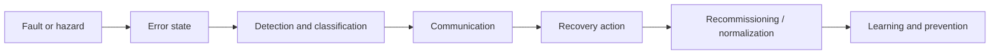

# Cross-Disciplinary Error Handling: Resilience, Communication, and Recovery

## Summary

Error handling is not a narrow coding concern. Across software, safety engineering, aviation, healthcare, and cybersecurity, it functions as a full control loop for undesirable states: detect, classify, communicate, recover, and learn.

The strongest cross-disciplinary pattern is a shift from **robustness** toward **resilience**. Robust systems resist known failures; resilient systems continue operating, degrade safely, and recover under surprise. The practical implication for prompt and workflow design is that error handling should be modeled as a first-class system capability with explicit contracts, recovery rules, escalation protocols, and learning loops.

The distinctive contribution of this paper is operational: it converts two large research drafts into a reusable review framework for prompts, specifications, architecture decisions, and incident analysis inside this repository.

## Context

This synthesis combines two source documents:

1. `Error Handling Across Disciplines.md` — a broad comparative survey of software architecture, industrial safety, aviation, and healthcare.
2. `error-handling-deep-research-report.md` — a more explicit operational framework covering taxonomy, contracts, architectural placement, communication, recovery, observability, and governance.

The goal is to distill these materials into a repository-standard research document that can support future prompts, workflows, and implementation guidance.

## Hypothesis / Question

Three questions guide this synthesis:

1. What principles of error handling remain stable across disciplines?
2. Where should error handling policy live in systems and workflows?
3. How should these findings influence prompt design for coding agents, reviewers, and specification authors?

## Method

This document is a structured synthesis of the two provided research drafts. I compared their shared concepts, normalized overlapping terminology, and prioritized patterns that appeared in multiple domains:

- dependability taxonomy (`fault -> error -> failure`)
- resilience engineering and high-reliability organization practices
- layered software error translation
- human-factors communication protocols
- safe recovery and graceful degradation patterns
- observability, postmortems, and organizational learning

Where the two drafts differed in emphasis, this synthesis favored the more operational framing from the deep research report while preserving the stronger cross-domain examples from the broader report.

## Results

### Key Findings

1. **Error handling is an end-to-end control system, not a localized exception mechanism.**
2. **The most reusable foundation is a shared taxonomy of fault, error, failure, and degraded mode.**
3. **Good systems separate machine-readable semantics from human-readable explanation.**
4. **Error policy belongs at architectural boundaries and points of control, not scattered through leaf logic.**
5. **Recovery should be chosen by risk and recoverability class, not by developer habit.**
6. **Human communication under stress needs explicit structure just as much as machine communication does.**
7. **Blameless learning loops are part of error handling, not an afterthought after incidents.**

### 1. A common vocabulary enables consistent handling

Both source documents converge on a dependable-computing view, though they begin from slightly different vocabularies. One source uses the software-engineering chain of **error, defect, bug, and failure/incident**; this synthesis normalizes those terms into a dependability frame for consistency.

- **Fault**: underlying cause or condition
- **Error**: incorrect internal state
- **Failure**: externally visible service deviation
- **Degraded mode / partial failure**: some value remains available despite loss of full function

This matters because many teams flatten all undesirable behavior into the word "error," which makes policy design weaker. A validation problem, a transient dependency timeout, a data integrity conflict, and a safety-critical hazardous state should not share the same handling strategy.

### 2. Resilience is the governing idea

The first source document emphasizes that modern systems cannot be made failure-free. The useful design target is **resilience**:

- anticipate failure modes
- monitor meaningful signals
- respond safely under pressure
- learn from incidents and near misses

This maps closely to resilience engineering's four capabilities:

| Capability | Core question | Typical mechanisms |
|---|---|---|
| Anticipate | What could go wrong next? | FMEA, pre-mortems, edge-case discovery |
| Monitor | What matters right now? | SLOs, alarms, telemetry, symptom monitoring |
| Respond | What should we do now? | retries, circuit breakers, checklists, escalation |
| Learn | What changed because this happened? | postmortems, disclosure, reporting systems |

### 3. Error meaning should be stable for machines and safe for humans

A major convergence across the source documents is the separation between **machine meaning** and **human wording**.

For software APIs this appears as structured problem contracts like RFC 7807 / RFC 9457 style responses:

- stable type/code for automation
- status/protocol mapping
- human summary and detail
- instance identifiers for the specific occurrence, often paired with separate correlation or trace identifiers
- optional structured sub-errors

For human operators the same principle appears differently:

- **SBAR** in healthcare structures high-stress communication
- **Aviate, Navigate, Communicate** orders emergency priorities in aviation
- alert systems should communicate priority, nature, initial action, and confirmation of effect

The shared lesson: meaning must be explicit, low-noise, and action-oriented.

### 4. Error handling belongs at boundaries

The software-specific material in the first source document is especially clear: raw infrastructure errors should not leak unchanged across layers.

A strong layered strategy is:

| Layer | Responsibility |
|---|---|
| Infrastructure | catch source errors, log rich technical context, preserve cause |
| Domain / application | translate into business-relevant categories |
| Protocol / interface | map domain categories to HTTP, gRPC, UI, or workflow responses |

This prevents two common failures:

1. **abstraction leakage** — business logic coupled to storage or transport specifics
2. **unsafe exposure** — stack traces, internals, and implementation details shown to clients or users

The deep research report generalizes this into a broader rule: put policy at points of control such as the UI boundary, client boundary, API edge, workflow orchestrator, and incident escalation layer.

### 5. Recovery should be selected, not improvised

Both source documents reject one-size-fits-all recovery. Good recovery depends on the type of failure and the risk of making things worse.

A useful practical palette is:

| Strategy | Best fit | Key constraint |
|---|---|---|
| Retry with backoff | transient dependency failure | only where retry is safe |
| Circuit breaker | sustained downstream instability | must prevent cascade and resource exhaustion |
| Bulkhead | contention between workloads | isolate resource pools |
| Fallback / cache | temporary unavailability | degraded result must remain truthful enough |
| Compensation / rollback | distributed partial completion | needs explicit reversal semantics |
| Fail-safe / stop | safety or integrity risk | protect humans/data over throughput |

The deep research report adds an important guardrail: retries should happen in a deliberately chosen layer, otherwise nested retries amplify overload.

### 6. Human-factors guidance is directly reusable for software

One of the strongest insights from both documents is that software teams underuse lessons from aviation and healthcare.

Reusable patterns include:

- **structured escalation** instead of free-form incident messaging
- **alarm prioritization** instead of threshold spam
- **checklists** for abnormal states and recommissioning
- **near-miss reporting** as a learning asset
- **just culture / blameless review** to preserve signal flow

Alarm fatigue is especially transferable. In clinical settings, too many low-value alarms reduce response quality. In software, noisy monitoring and weak alerts create the same effect. The right move is not more alerts but better alert semantics tied to user impact.

### 7. Error handling includes recovery after the immediate event

The first source document extends beyond detection and mitigation into recommissioning and disclosure:

- aviation uses memory items and non-normal checklists
- manufacturing treats restart and shutdown transitions as high-risk periods
- healthcare uses structured disclosure and trust restoration after harm
- software increasingly uses self-healing loops and automated remediation

This broadens the scope of error handling. Recovery is not complete when the immediate symptom disappears; it ends when the system is safely back within acceptable operating boundaries and the organization has updated its understanding.

### 8. Cross-disciplinary comparison

The shared patterns become clearer when the disciplines are compared side by side:

| Discipline | Detection style | Communication protocol | Recovery model | Transferable lesson |
|---|---|---|---|---|
| Software / distributed systems | telemetry, exceptions, symptom monitoring, SLOs | structured error contracts, logs, traces, incident channels | retry, circuit breaker, rollback, graceful degradation | Put policy at boundaries and keep machine semantics stable |
| Safety engineering / industrial systems | hazard analysis, FMEA, safety instrumentation | alarms, procedures, safety cases | fail-safe states, engineered barriers, controlled restart | Design for tolerable risk, not perfect operation |
| Aviation | cockpit instruments, warnings, checklist triggers | Aviate-Navigate-Communicate, CRM, standardized callouts | memory items, non-normal checklists, controlled diversion | Prioritize workload and communication under stress |
| Healthcare | incident reporting, bedside observation, escalation criteria | SBAR, disclosure, handoff protocols | stabilization, escalation, disclosure, systemic follow-up | Structure communication to reduce ambiguity and hierarchy friction |
| Cybersecurity / incident response | event monitoring, detection pipelines, triage | incident classification, escalation paths, evidence handling | containment, eradication, recovery, retrospective review | Treat escalation and evidence preservation as first-class protocol design |

This table also highlights an important edge condition: patterns do not transfer unchanged. A consumer app may prefer graceful degradation where an industrial controller must enter a fail-safe stop. The right transfer filter is the domain's harm model, reversibility, and integrity or safety requirement.

## Analysis

### A unified model

The two source documents support a single cross-disciplinary model:

This model is useful because it avoids several common simplifications:

- equating error handling with try/catch blocks
- equating communication with logging
- equating recovery with retry
- equating postmortems with optional documentation

### What the sources add to each other

The broad survey contributes:

- stronger examples from industrial safety, aviation, and healthcare
- richer treatment of Poka-Yoke, FMEA, hierarchy of controls, SBAR, and graceful degradation
- a resilience-engineering frame that links prevention, monitoring, response, and learning

The deep research report contributes:

- a cleaner operational taxonomy
- clearer architectural guidance about policy placement
- more explicit machine/human contract design
- stronger recovery decision logic
- better observability, governance, and metric framing

Taken together, these complementary strengths justify a unified design framework that is operational enough for software teams and prompt authors without losing the depth of the cross-domain material.

### Most transferable design rules

The synthesis yields eight design rules that are strong enough to guide prompts and implementation reviews:

1. **Name failure classes explicitly.**
2. **Separate detection, classification, communication, and recovery.**
3. **Keep machine codes stable; keep human messages actionable.**
4. **Translate errors at boundaries instead of leaking internals upward.**
5. **Choose recovery strategies by safety, integrity, and idempotency.**
6. **Optimize alert precision, not alert volume.**
7. **Design degraded modes deliberately.**
8. **Require a learning loop after meaningful incidents and near misses.**

## Practical Applications

### For prompt engineering

These findings support stronger prompts for:

- **implementation planning** — require explicit negative paths, degraded modes, and recovery policies
- **code review** — inspect boundary translation, retry placement, logging scope, and user-facing message quality
- **debugging** — distinguish fault, error state, failure symptom, and recovery options
- **specification review** — require unwanted behavior clauses and clear response semantics
- **incident analysis** — structure outputs around detection, communication, mitigation, and follow-up learning

### For repository prompts and skills

This research could directly strengthen:

- `prompt-task-plan-review.md` and `prompt-workflow-implement-plan.md` by requiring explicit failure classes, retry eligibility, degraded-mode behavior, and escalation semantics in every phase
- `prompt-task-specification-evaluation-diagnostician.md` by adding checks for negative paths, protocol-safe error contracts, fallback behavior, and operator-visible recovery states
- `prompt-task-testability-implementability-evaluator.md` by requiring that each error path be testable, observable, and mapped to a concrete recovery rule
- `prompt-task-rca-diagnostician.md` by separating fault, error state, failure symptom, containment, and learning actions in incident writeups
- `prompt-system-context-guardian.md` by encouraging reuse of canonical error abstractions instead of ad hoc retries, one-off logging, or inconsistent user-facing messages

For coding agents specifically, this research suggests a minimum error-handling checklist for generated plans and specs:

- enumerate failure classes explicitly
- state which failures are retryable and why
- define degraded-mode behavior
- specify escalation thresholds and operator actions
- attach observability requirements to each meaningful failure path

### For software architecture guidance

A concise checklist derived from the synthesis:

- Define canonical error classes.
- Map each class to a protocol-safe representation.
- Decide the single retry layer.
- Add instance, correlation, and structured telemetry identifiers.
- Specify degraded-mode behavior per critical journey.
- Set escalation thresholds based on user impact.
- Document operator playbooks for abnormal states.
- Require post-incident review and action tracking.

A simple recovery decision matrix makes the tradeoffs clearer:

| If the primary concern is... | Prefer... | Avoid... |
|---|---|---|
| transient unavailability | bounded retry with backoff | unbounded or multi-layer retries |
| sustained dependency instability | circuit breaker or fallback | waiting indefinitely on downstream recovery |
| partial completion across steps | compensation or rollback | pretending the workflow was atomic |
| reduced but acceptable service | graceful degradation | total failure when a truthful reduced mode exists |
| safety or integrity risk | fail-safe stop or operator escalation | automatic continuation under uncertainty |

## Limitations

- This document is a synthesis of two draft reports, not a fresh primary-source literature review.
- The source documents emphasize conceptual and operational best practices more than quantitative effectiveness comparisons.
- Some examples are domain-specific and need adaptation before direct import into software workflows.
- The synthesis intentionally prioritizes transferable principles over exhaustive citation fidelity.

## Related Prompts

- `prompt-task-rca-diagnostician.md` - extends the learning loop by turning failures into structured incident and causal analysis
- `prompt-system-context-guardian.md` - encourages reuse of shared error abstractions instead of ad hoc handling patterns
- `prompt-task-specification-evaluation-diagnostician.md` - catches missing negative paths, degraded-mode behavior, and weak recovery semantics
- `prompt-task-testability-implementability-evaluator.md` - checks whether error behavior is explicit, testable, and implementable

## References

### Primary synthesis inputs

- `Error Handling Across Disciplines.md` - broad comparative source covering software architecture, safety engineering, aviation, healthcare, resilience engineering, and communication protocols
- `error-handling-deep-research-report.md` - operational source covering taxonomy, error contracts, policy placement, recovery strategies, observability, governance, and metrics

### Related repo research

- `content/research-paper-cross-disciplinary-root-cause-analysis.md` - complementary framework for post-incident learning, causal analysis, and blameless follow-up

### Key standards and frameworks surfaced by the source materials

- RFC 7807 / RFC 9457 problem details - structured machine-readable API error semantics for stable type/code, occurrence identity, and client-safe error payloads
- resilience engineering and high-reliability organization principles - the anticipate/monitor/respond/learn model for operating under pressure and surprise
- SBAR and aviation emergency communication protocols such as Aviate-Navigate-Communicate and CRM - structured human communication under stress and workload prioritization
- FMEA, hierarchy of controls, and safety-instrumented thinking - prevention, mitigation, engineered barriers, and safe-state design
- alert-fatigue and observability guidance - prioritizing meaningful, actionable signals over noisy threshold-based alerting

## Future Research

1. Create a dedicated research note on **error contract design** across HTTP, gRPC, async messaging, and UI.
2. Derive a reusable **prompt checklist for error handling reviews**.
3. Compare **graceful degradation** patterns by product type: CRUD apps, workflows, realtime systems, and AI agents.
4. Study how **blameless postmortem practice** changes prompt quality in debugging and planning workflows.
5. Connect this work with repository research on **edge-case discovery** and **testability/implementability**.

## Version History

- 1.0.0 (2026-04-16): Initial synthesis from the two provided error-handling research drafts.
