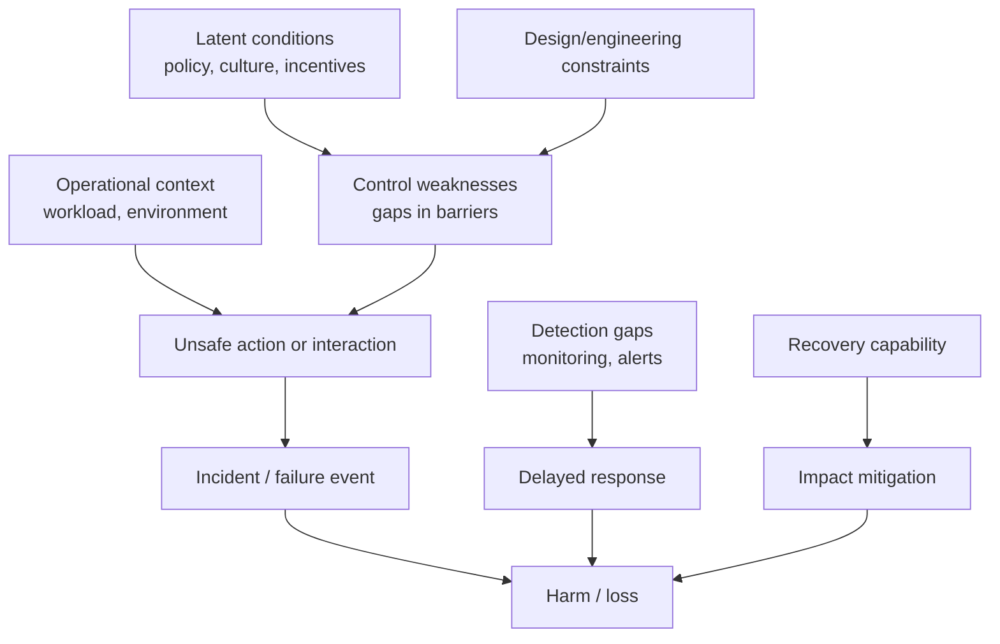

# Cross-Disciplinary Root Cause Analysis: Practices, Evidence Standards, and AI-Assisted Workflows

## Summary

**Seven principles, three axes of difference, and one governing framework for AI — distilled from twelve disciplines.**

Root cause analysis (RCA) is a family of investigative practices whose shared aim is to explain *why something happened* in a way that supports effective, verified prevention rather than superficial symptom fixes. This paper synthesizes RCA methodologies across twelve disciplines—engineering, software, healthcare, psychology, ecology, law, education, manufacturing, safety investigation, finance, social science, and business—identifying universal principles, key differences in causality standards and evidence regimes, a practical methods atlas, common failure modes, and a governed framework for AI-assisted RCA.

## Context

AI systems and human organizations share a systemic bias toward symptom management. Symptoms are visible, immediate, and operationally accessible; root causes are latent, complex, and embedded in non-linear systems. This produces "firefighting" cultures—in organizations, in incident response, and in ML models that exploit spurious correlations (the "Clever Hans effect") rather than learning causal features.

No single discipline owns RCA. Engineering has FTA/FMEA, healthcare has RCA2, psychology has functional behavioral assessment, ecology has causal loop diagrams, IT has ITIL problem management, and social science has causal inference frameworks. Each has evolved rigorous methods, but they remain siloed. A cross-disciplinary synthesis reveals both transferable invariants and critical differences that practitioners must respect when importing methods across domains.

## Hypothesis / Question

Three guiding questions:

1. **What principles generalize across all RCA disciplines?** Are there universal invariants beneath the differing vocabularies?
2. **Where do disciplines legitimately differ, and why?** What counts as "cause," what counts as evidence, and what standard of proof applies?
3. **How can AI accelerate RCA without degrading it?** What governance and design constraints prevent AI-assisted RCA from producing plausible-but-wrong narratives?

## Method

Synthesis of primary standards (IEC 61025 FTA, MIL-STD-1629A FMECA, NIST SP 800-61, WHO patient safety guidance, ICAO Annex 13, EPA CADDIS), authoritative guidance (AHRQ PSNet, NIST AI RMF, Bradford Hill viewpoints, OECD DAC criteria), peer-reviewed research (causal inference, shortcut learning, confirmation bias, psychological safety), and practitioner frameworks (ITIL 4, Six Sigma DMAIC, 8D, RCA2 action hierarchy, CBT case formulation, functional behavioral assessment). Synthesized from source analyses covering 70+ primary references; this paper cites 44 directly (see References).

## Results

### Key Findings

#### 1. Seven universal RCA principles

Despite differing vocabularies, rigorous RCA across all disciplines converges on seven principles:

1. **Operationalize the outcome.** Define what failed, how it is measured, and why it matters—not just "bad thing happened."
2. **Reconstruct the event sequence and context.** Map timeline, constraints, and decision points; resist hindsight compression.
3. **Generate multiple hypotheses.** Actively seek disconfirming evidence; avoid early closure.
4. **Separate analytical levels.** Distinguish mechanism, process control, organizational policy, and regulatory environment; test whether each is necessary/sufficient.
5. **Prefer system changes over person-only fixes** when the system predictably creates error conditions.
6. **Link causes to actions via modifiability.** The "best" causes are those you can control and that meaningfully reduce risk.
7. **Verify effectiveness** with measurable follow-up—otherwise RCA becomes paperwork.

#### 2. "Root cause" is rarely singular

Many disciplines increasingly treat adverse outcomes as arising from multiple interacting factors—latent conditions, active failures, environmental context, and organizational decisions—rather than a single "the" cause. This is explicit in systems safety thinking (layered defenses, "Swiss cheese" model) and in formal fault models that produce sets of minimal cut sets.

#### 3. Three axes of cross-disciplinary difference

The most important differences are not the aspiration to find causes, but:

| Axis | How it varies |
|---|---|
| **What "cause" means** | Safety prevention vs. legal liability vs. statistical identification vs. behavioral function |
| **What counts as evidence** | Physical tests and inspections vs. clinical trials vs. observational designs vs. qualitative fieldwork vs. log analysis |
| **Standard of proof** | Engineering plausibility and reproducibility vs. statistical significance vs. weight-of-evidence vs. admissible expert testimony (Daubert/Rule 702) |

#### 4. Explanation vs. intervention: a critical distinction

Some investigations aim to **explain** what happened (narrative and mechanism). Others aim to **identify interventions** that would have prevented it (counterfactual: "if we changed X, would Y change?"). Modern causal inference formalizes the intervention question with causal graphs and counterfactual reasoning; engineering safety formalizes it through fault models and barrier design.

For example, the NTSB investigation of the Challenger disaster *explained* the failure sequence (cold temperatures degraded O-ring seals, allowing hot gas blow-by). An FTA *identifies the intervention*: which seal redesign or launch-constraint change would have prevented the failure. Both are valuable, but they answer fundamentally different questions and require different methods.

#### 5. RCA fails from cognitive and organizational barriers, not lack of method

The most pervasive causes of RCA failure are not methodological gaps but systemic cognitive and organizational forces—confirmation bias, blame displacement, first-order change resistance, and firefighting cultures—that predictably degrade any method. See the Analysis section for a detailed treatment.

#### 6. AI shortcut learning mirrors human symptom bias

ML models exhibit the same vulnerability at scale: they optimize for loss reduction via spurious correlations rather than learning causal features. This manifests as:

- Medical imaging models classifying based on scanner brand or hospital tags rather than tissue pathology
- NLP models mimicking prompt structure rather than demonstrating semantic understanding
- Algorithmic bias when trained on historical expenditure data (a symptom of socioeconomic access) rather than actual clinical need

Empirical studies show that humans who collaborate with biased AI systems internalize the AI's erroneous reasoning and continue making identical errors even after AI support is removed ("human inheritance of AI bias").

### Methods atlas

RCA tools group into six method families (containing eleven distinct methods), each answering a different question. The families are: structured brainstorming (5 Whys, Fishbone), failure logic and reliability (FTA, FMEA/FMECA), safety systems and sociotechnical models (STAMP/STPA), causal inference and evaluation (DAG/SCM, randomized trials, Bayesian networks), qualitative inquiry (ethnographic methods), and guided investigation systems (postmortems, RCA2 action hierarchy).

| Method family | Best-fit question | Strengths | Weaknesses | Typical outputs |
|---|---|---|---|---|
| **5 Whys** | What upstream condition made this possible? | Fast; forces beyond symptoms | Stops early; linear storytelling | Causal chain; candidate fixes |
| **Fishbone/Ishikawa** | What categories of causes should we consider? | Team-friendly; broad coverage | Can become untested list | Cause categories; hypothesis list |
| **FTA** | What combinations lead to the top event? | Explicit Boolean logic; quantifiable; minimal cut sets | Model depends on completeness | Fault tree; cut sets; risk contributors |
| **FMEA/FMECA** | Where might it fail, how bad, what controls? | Preventive; risk-ranked | Bureaucratic; scoring subjectivity | Ranked failure modes; action plan |
| **STAMP/STPA** | What control/interaction failures create hazards? | Suited to complex sociotechnical systems | Requires expertise; time-intensive | Unsafe control actions; redesign |
| **Causal inference (DAG/SCM)** | Would intervention X change outcome Y? | Clarifies assumptions; separates confounding | Hard with unmeasured confounders | Causal model; identified estimands |
| **Randomized trials** | Does the intervention work? | Strong internal validity | Cost/ethics; generalization limits | Effect size; confidence intervals |
| **Qualitative/ethnographic** | How do practices and incentives generate outcomes? | Reveals hidden work; explains mechanisms | Subjectivity; transferability limits | Thematic findings; process narratives |
| **Bayesian networks** | Given evidence, what is the most probable cause? | Handles uncertainty; updates with evidence | Structure assumptions; can encode bias | Probabilistic diagnosis |
| **Postmortems** | What failed in detection, response, recovery? | Improves resilience; systemic focus | Can devolve into blame or shallow actions | Incident report; action items |
| **RCA2 action hierarchy** | Are our actions strong enough? | Pushes toward high-leverage fixes | Needs leadership support | Strong/intermediate/weak action portfolio |

### Evidence standards by discipline

| Discipline | "Cause" framed as | Evidence sources | Validation approach | Typical outputs |
|---|---|---|---|---|
| Engineering | Physical mechanism; failure combinations | Tests, inspections, design specs | Reproducibility; model consistency (FTA/FMEA) | Fault tree, FMEA tables, redesign actions |
| Software/AI | System behavior under configurations | Logs, traces, metrics, config histories | Reproduction in staging; rollback tests | Post-incident analysis, action items, SLO changes |
| Healthcare | System vulnerabilities enabling harm | Charts, reports, device data, interviews | RCA2 action hierarchy; trial standards (CONSORT, STROBE) | RCA report, action hierarchy, patient safety metrics |
| Psychology | Functional relation: antecedent–behavior–consequence | Interviews, behavioral observation, assessments | Functional analysis (experimental manipulation) | Case formulation, function-based intervention plan |
| Ecology | Candidate stressors causing impairment | Field monitoring, lab tests, literature | Weight-of-evidence (EPA CADDIS); Bradford Hill viewpoints | Candidate causes ranked; remediation targets |
| Law | Actual + proximate cause tied to liability | Testimony, forensic evidence, records | Rule 702 reliability; Daubert scientific validity | Legal causation argument; evidentiary record |
| Education | System and practice causes of learning outcomes | Assessment data, attendance, observations, stakeholder input | Continuous improvement cycles (PDSA); structured RCA facilitation | Theory of action, improvement plan, cycle metrics |
| Social science | Causal effect of policies/programs | Surveys, admin data, natural experiments | Experimental/quasi-experimental designs; OECD criteria | Impact estimates, theory of change, policy recommendations |
| Manufacturing | Process variation; escapes in control systems | SPC charts, defects, process maps | DMAIC; FMEA-to-controls linkage; yield/defect trends | Containment + permanent corrective actions, control plans |
| Business | Process and incentive failures; governance gaps | KPIs, audits, complaints, HR data, process maps | Audit evidence; effectiveness monitoring; psychological safety | Corrective action plans, control redesign, incentive changes |
| Safety investigation | Contributing factors across barriers and human factors | On-scene evidence, records, interviews | Probable cause determination (NTSB); ICAO Annex 13 | Public reports; recommendations; regulatory changes |
| Finance | Control failures and operational risk drivers | Trade logs, change records, audits | Basel operational risk principles; forensic accounting | Control remediation, loss event taxonomy, audit trails |

### Cross-disciplinary RCA workflow

A generic RCA sequence consistent with NIST incident handling, WHO patient safety guidance, and quality improvement cycles:

```mermaid
flowchart LR
  A[Detect / trigger<br/>incident, defect, harm] --> B[Triage & stabilize<br/>containment actions]
  B --> C[Define scope & outcome<br/>what/where/when/severity]
  C --> D[Assemble team<br/>domain + process + independent]
  D --> E[Collect evidence<br/>logs, records, interviews]
  E --> F[Reconstruct timeline<br/>sequence + decision points]
  F --> G[Generate hypotheses<br/>multiple candidate causes]
  G --> H[Test & refine<br/>experiments, counterfactuals]
  H --> I[Select actions<br/>prefer strong system changes]
  I --> J[Implement & assign<br/>ownership + deadlines]
  J --> K[Verify effectiveness<br/>metrics + audits]
  K --> L[Institutionalize learning<br/>update standards, controls]
```

### Minimum viable rigor checklist

- **Problem definition**: Is the outcome measurable, time-bounded, and severity-scoped?
- **Boundary and comparison**: What is the "normal" process and what changed? What is the counterfactual?
- **Evidence inventory**: Do we have at least three independent evidence streams?
- **Hypothesis discipline**: Did we document alternative hypotheses and what would falsify each?
- **Mechanism plausibility**: For each claimed cause, can we explain the mechanism (not just correlation)?
- **Action quality**: Do actions materially change system constraints/barriers, or are they weak reminders/training-only?
- **Ownership and resources**: Is there a named owner, deadline, and authority?
- **Effectiveness verification**: What metric(s) will confirm risk reduction, and what is the monitoring period?
- **Learning loop**: How will the organization update standards, training, design reviews, monitoring, and audits?

### AI-assisted RCA: governed workflow

AI can help as an **evidence-handling accelerator** (anomaly detection, evidence summarization, causal modeling support). AI can hinder through **plausible narrative hallucination**, **opacity and unverifiable reasoning**, and **automation bias** (humans deferring to model outputs even when evidence is weak).

Best practices grounded in NIST AI RMF and causal inference fundamentals:

1. **Provenance-first**: every AI-produced claim links to underlying evidence artifacts and is auditable.
2. **Explainability by design**: apply NIST XAI principles to any AI output used for decisions.
3. **Causal guardrails**: do not allow AI to promote associations to "root causes" without an established causal model or explicit uncertainty.
4. **Human-in-the-loop decision rights**: AI proposes; accountable humans decide, document rationale, and verify outcomes.
5. **Post-deployment learning**: treat the AI tool itself as part of the sociotechnical system—monitor drift, retraining impacts, and error modes.

These principles apply to each AI component in the RCA pipeline independently. An organization using one ML model for anomaly detection and an LLM for evidence summarization needs separate provenance, explainability, and causal guardrail assessments for each, since their failure modes and governance requirements differ.

## Analysis

### Why symptom management persists

The persistence of symptom-over-cause preference is not individual weakness but a systemic property of complex environments under temporal and cognitive constraints. Six reinforcing mechanisms explain why every discipline struggles with the same failure modes:

- **Confirmation bias and early closure.** Investigators overweight evidence supporting the first plausible story and under-seek disconfirming evidence. Nickerson (1998) documents this as pervasive across all reasoning domains. The result is premature narrative closure — a socially acceptable "root cause" that is actually the first hypothesis that survived minimal scrutiny.
- **"Correlation implies causation" overreach.** Observational associations are promoted to causal status without acknowledging confounders. This is especially common in data-rich domains (software telemetry, healthcare records, financial logs) where pattern-matching tools surface correlations faster than investigators can assess causal validity.
- **Symptom treatment masquerading as root-cause elimination.** Containment actions (quick fixes) get mistaken for structural fixes. When the problem recurs, it is blamed on people ("they didn't follow the procedure") rather than on system design that predictably recreates the error conditions.
- **Blame displacement.** Focusing on individuals is cognitively and politically easier than changing incentives, staffing, interface design, or organizational constraints. Safety culture guidance from healthcare (AHRQ), aviation (EUROCONTROL just culture), and software (blameless postmortems) consistently warns against this trap — but the gravitational pull toward blame remains strong.
- **First-order vs. second-order change resistance.** Root cause resolution requires second-order (transformational) change that disrupts expectations and challenges fundamental assumptions about how the system works. Management frequently opts for first-order symptom patches — retraining, reminders, policy memos — to preserve perceived stability and avoid the organizational anxiety of genuine restructuring.
- **The political economy of firefighting.** Organizations inadvertently reward rapid visible crisis response over quiet methodical prevention. Symptoms are urgent, visible, and communicable; prevention work yields abstract, delayed results that are difficult to attribute. This creates a self-reinforcing cycle where the people who fix symptoms are heroes and the people who prevent problems are invisible.

From a general systems theory perspective, these mechanisms all share the same structure: symptoms are downstream manifestations of upstream failures, and every force listed above biases attention toward the downstream (visible, immediate) end of the causal chain.

### The AI mirror

AI shortcut learning is computationally isomorphic to human symptom bias. Neural networks latch onto spurious correlations (the "symptom") because they are computationally easier than learning invariant causal features. This produces excellent training metrics but catastrophic deployment failures. Causal AI, invariant risk minimization, and emerging evaluation methods (e.g., topologically designed shortcut-free benchmarks) represent countermeasures, but require deliberate architectural and evaluation discipline.

### What transfers across disciplines, what doesn't

**Transfers well:**
- The seven universal principles
- The explanation-vs-intervention distinction
- The emphasis on multiple interacting causes rather than single-cause narratives
- The action quality hierarchy (strong system changes > weak reminders)
- The requirement for effectiveness verification

**Does not transfer without adaptation:**
- Specific evidence standards (a weight-of-evidence approach valid in ecology is not sufficient for clinical trial evidence)
- Causality definitions (legal proximate cause is a different construct from epidemiological causal effect)
- Method selection (FTA requires engineering system models; functional analysis requires behavioral observation; DAG/SCM requires domain knowledge of confounding structure)

### When disciplines collide

The hardest case for cross-disciplinary RCA arises when a single event must satisfy multiple disciplines simultaneously — e.g., a medical device failure that is at once an engineering failure (FTA/FMEA), a healthcare safety event (RCA2), and a potential product liability matter (Daubert admissibility). The three axes of difference (causality definition, evidence standard, standard of proof) mean that a single unified RCA rarely satisfies all stakeholders. In practice, multi-jurisdictional RCA requires parallel analyses with explicit mapping between them: the engineering investigation feeds factual findings into both the healthcare safety review and the legal evidentiary record, but each applies its own causality standard to those shared facts.

## Practical Applications

- **Software incident analysis**: Use the 12-step workflow and rigor checklist to structure postmortems. Apply the action hierarchy to push beyond "add a monitor" toward architectural prevention. Use the AI-governed workflow when ML is involved in signal detection.
- **AI system debugging**: Recognize shortcut learning as the AI equivalent of symptom-level analysis. Apply OOD testing, slice analysis, and ablation sensitivity mapping to verify causal feature learning.
- **Prompt engineering for investigation tasks**: Structure prompts to enforce multiple hypothesis generation, disconfirming evidence seeking, and explicit uncertainty—countering the LLM tendency toward single-narrative closure.
- **Cross-functional reviews**: Use the methods atlas to select the right tool for the question being asked. A fishbone diagram answers a different question than an FTA or a DAG.
- **Organizational learning**: The checklist and action hierarchy provide a lightweight governance framework for any team that wants to move from reactive firefighting to proactive prevention.
- **Healthcare patient safety teams**: Use the evidence standards table to map from incident type to appropriate validation approach. Apply the rigor checklist to push RCA2 teams beyond "retrain staff" toward system-level controls.
- **Manufacturing quality engineers**: Cross-reference the methods atlas (FMEA for component-level, FTA for system-level) with the DMAIC validation approach to build control plans that survive audit.
- **Ecological and environmental assessment**: Use the three-axes framework to communicate why weight-of-evidence conclusions (valid in CADDIS) do not automatically satisfy regulatory or legal causation standards when the same stressor is subject to enforcement action.

## Limitations

- This synthesis draws on established standards and published research but does not present new empirical data. The universal principles are inductively derived from cross-disciplinary pattern matching.
- Method effectiveness comparisons are qualitative; no meta-analytic quantification of relative RCA method efficacy was attempted.
- AI-assisted RCA is a rapidly evolving area; the governance recommendations reflect 2025-era frameworks (NIST AI RMF 1.0, NISTIR 8312) and will need revision.
- The synthesis necessarily compresses discipline-specific nuance. Practitioners should consult domain-specific standards before applying methods outside their home discipline.

## Related Prompts

- prompt-task-systematic-debugging.md — Uses Medical DDx workflow for root cause investigation in software
- research-design-in-practice-methodology.md — Hickey's six-phase methodology includes a Diagnose phase for root cause identification
- research-paper-bias-detection-prevention-mitigation.md — Overlaps on algorithmic bias detection and causal auditing
- research-paper-cognitive-architectures-for-prompts.md — Discusses Medical DDx as a cognitive architecture applicable to RCA

## References

### Primary standards and official guidance

1. IEC 61025:2006. *Fault tree analysis (FTA).*
2. MIL-STD-1629A. *Procedures for Performing a Failure Mode, Effects, and Criticality Analysis.*
3. EN IEC 60812:2018. *Analysis techniques for system reliability — Procedure for failure mode and effects analysis (FMEA).*
4. NIST SP 800-61 Rev. 2. *Computer Security Incident Handling Guide.*
5. NISTIR 8312. *Four Principles of Explainable Artificial Intelligence.*
6. NIST AI 100-1. *Artificial Intelligence Risk Management Framework (AI RMF 1.0).*
7. WHO. *Patient safety incident reporting and learning systems: technical report and guidance.* 2020.
8. ICAO. *Annex 13: Aircraft Accident and Incident Investigation.*
9. EPA. *CADDIS: Causal Analysis/Diagnosis Decision Information System.*
10. ICH E6(R3). *Good Clinical Practice.*
11. OECD DAC. *Evaluation criteria.*
12. HM Treasury. *Magenta Book: Central Government Guidance on Evaluation.*

### Healthcare and patient safety

13. AHRQ PSNet. *Root Cause Analysis Primer.* https://psnet.ahrq.gov/primer/root-cause-analysis
14. National Patient Safety Foundation. *RCA2: Improving Root Cause Analyses and Actions to Prevent Harm.* https://www.ihi.org/library/tools/rca2-improving-root-cause-analyses-and-actions-prevent-harm
15. StatPearls. *Medical Error Prevention and Root Cause Analysis.* https://www.ncbi.nlm.nih.gov/books/NBK570638/

### Causal inference and methodology

16. Hernán, M.A. & Robins, J.M. *Causal Inference: What If.* https://www.hsph.harvard.edu/miguel-hernan/causal-inference-book/
17. Pearl, J. *Causality: Models, Reasoning, and Inference.*
18. Peters, J., Janzing, D. & Schölkopf, B. *Elements of Causal Inference.*
19. Bradford Hill, A. "The Environment and Disease: Association or Causation?" *Proceedings of the Royal Society of Medicine*, 1965.

### Cognitive and organizational factors

20. Kahneman, D. *Thinking, Fast and Slow.* (System 1 / System 2 dual-process theory.)
21. Nickerson, R.S. "Confirmation bias: A ubiquitous phenomenon in many guises." *Review of General Psychology*, 1998.
22. Edmondson, A. *The Fearless Organization.* (Psychological safety as a condition for learning.)
23. Reason, J. *Managing the Risks of Organizational Accidents.* (Swiss cheese model, reporting culture, just culture.)

### AI shortcut learning and algorithmic bias

24. Geirhos, R. et al. "Shortcut learning in deep neural networks." *Nature Machine Intelligence*, 2020. (Clever Hans effect in AI.)
25. Obermeyer, Z. et al. "Dissecting racial bias in an algorithm used to manage the health of populations." *Science*, 2019.
26. Bogert, E. et al. "Humans inherit artificial intelligence biases." *Scientific Reports*, 2023. https://pmc.ncbi.nlm.nih.gov/articles/PMC10547752/
27. Sculley, D. et al. "Hidden Technical Debt in Machine Learning Systems." *NeurIPS*, 2015.

### Reporting and evidence quality standards

28. CONSORT. *Consolidated Standards of Reporting Trials.*
29. STROBE. *Strengthening the Reporting of Observational Studies in Epidemiology.*
30. PRISMA. *Preferred Reporting Items for Systematic Reviews and Meta-Analyses.*
31. COREQ. *Consolidated Criteria for Reporting Qualitative Research.*

### IT and quality management

32. ASQ. *Root Cause Analysis.* https://asq.org/quality-resources/root-cause-analysis
33. Splunk. *IT/ITIL Problem Management.* https://www.splunk.com/en_us/blog/learn/problem-management.html
34. ASQ. *DMAIC and 8D structured problem-solving.*

### Safety investigation

35. NTSB. *Public investigation process.* (On-scene fact gathering, probable cause determination.)
36. EUROCONTROL. *Just Culture guidance.*

### Ecology and environment

37. EPA CADDIS. *Causal assessment and case studies.* (Presumpscot River probable cause example.)
38. IPCC. *Detection and attribution guidance documents.*

### Case studies referenced

39. NASA. Challenger (Mission 51-L) — Presidential Commission findings on O-ring seal failure.
40. GitHub. 2018 database incident — public post-incident analysis.
41. Wells Fargo. 2016 sales practices — CFPB and OCC enforcement actions.
42. Moving to Opportunity (MTO). NBER randomized housing mobility experiment.
43. Knight Capital. 2012 trading incident — SEC findings on technology controls.

### Education

44. IES/REL Midwest. *Root Cause Analysis facilitator guide for networked improvement communities.* (PDSA cycles, theory of action.)

## Future Research

- **Empirical validation of cross-disciplinary transfer.** Test whether the seven universal principles measurably improve RCA quality when adopted by teams outside their discipline of origin.
- **AI-RCA interaction studies.** Measure automation bias effects when LLMs generate RCA narratives vs. when they serve as constrained evidence retrieval tools.
- **Prompt patterns for causal reasoning.** Develop and test prompt architectures that enforce counterfactual reasoning, multiple hypothesis generation, and explicit uncertainty quantification in AI-assisted investigations.
- **Action hierarchy effectiveness metrics.** Longitudinal studies comparing recurrence rates for organizations using strong (system redesign) vs. weak (training/reminders) corrective actions across domains.
- **Causal AI benchmarks.** Evaluate whether causal representation learning methods (invariant risk minimization, causal discovery) produce meaningfully different RCA outcomes than standard predictive models in real-world incident datasets.

## Version History

- 1.0.0 (2026-04-11): Initial synthesis from two deep research sources — "The Causality Imperative: Transcending Symptom Management Through Cross-Disciplinary Root Cause Analysis" (`Investigating Root Causes Across Disciplines.md`, narrative/theoretical) and "Root Cause Analysis Across Disciplines: Practices, Evidence Standards, Methods, and AI-Assisted Workflows" (`rca-deep-research-report.md`, structured/practical). Both source files are at the repository root.
- 1.0.1 (2026-04-11): Rule of 5 review fixes — deduplicated Analysis/Results, added mermaid diagrams, corrected method family count, added Education and Business disciplines, expanded practical applications, added multi-discipline conflict analysis, fixed citations.
