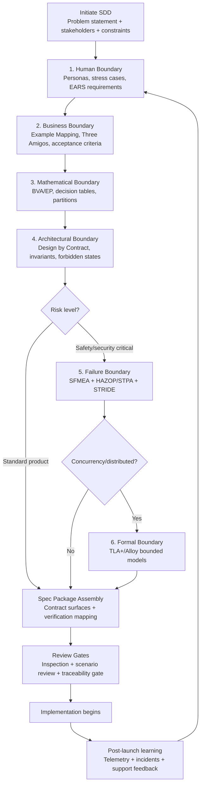

# Specification-Driven Edge Case Discovery and Gap Analysis: Cross-Disciplinary Protocols for Pre-Implementation Robustness

## Summary

Synthesizes cross-disciplinary protocols for discovering edge cases, failure modes, and specification gaps *before* implementation begins. The central contribution is a six-boundary analytical framework (Human, Business, Mathematical, Architectural, Failure, Formal) that organizes protocols from SbE/BDD, test design, Design by Contract, formal verification, FMEA, security threat modeling, and UX stress-case analysis into a sequenced meta-protocol. Directly addresses the "specification deficit" amplified by AI-assisted coding workflows where incomplete specs produce fragile, "house of cards" code.

## Context

Specification-driven development (SDD) systematically fails to capture real-world constraints, historical context, and edge cases beyond the "happy path." This creates an "illusion of completeness" where detailed specifications mask behavioral blind spots until production exposure. AI coding agents exacerbate the vulnerability: proficient at pattern completion, they cannot infer unstated intent or anticipate undocumented constraints, producing structurally plausible but functionally fragile implementations. Oversized monolithic specifications further trigger a "lost in the middle" problem, causing context drift, requirements amnesia, and endless correction loops.

This research synthesizes two complementary analyses: a broad survey of proven SDD assurance practices across software engineering, systems engineering, safety-critical, security, UX, and regulatory domains; and a deep-dive into the mathematical, architectural, and human-centric protocols that confine the specification's input space and failure surface.

## Hypothesis / Question

Can a unified, cross-disciplinary meta-protocol systematically surface and reduce specification gaps and edge cases *before* implementation, and is this protocol particularly critical for AI-assisted development workflows?

## Method

Synthesis of established protocols from seven disciplines, evaluated for pre-implementation applicability, effort level, and AI-readiness:

1. **Software engineering** - Example-driven specification (SbE/BDD), property-based testing, structured reviews
2. **Test design** - Boundary Value Analysis, Equivalence Partitioning, Decision Tables
3. **Software architecture** - Design by Contract (preconditions/postconditions/invariants)
4. **Formal methods** - TLA+ model checking, Alloy relational analysis
5. **Safety engineering** - FMEA/HAZOP/STPA hazard analysis
6. **Security engineering** - STRIDE threat modeling, attack trees
7. **UX/Human factors** - Stress cases, extreme personas, EARS requirements syntax

Each protocol was assessed against: (a) ability to force specificity through concrete examples, (b) ability to force completeness through systematic perturbation, and (c) ability to force accountability through traceability and review.

## Results

### Key Findings

1. **The SDD assurance stack works without implementation.** The literature describes a pragmatic five-layer *process* stack: example-first behavior capture, no-code edge-case discovery, gap analysis with traceability, tool-supported contracts, and gated governance reviews. This paper reorganizes these into a six-boundary *analytical* framework (see below) that provides clearer guidance on what each layer must prove.

2. **Edge cases are a superset across disciplines.** They include user errors and environmental constraints (UX), component failures and unsafe interactions (safety), and attacker behaviors (security). A unified scenario catalog with a consistent classification scheme (happy/error/abuse/hazard paths) can host all three.

3. **AI agents require stricter specifications than human developers.** Without bounded contexts, defined edge cases, and DbC invariants, LLMs hallucinate logic, introduce regressions, and break adjacent patterns. Specs must function as immutable contracts, not negotiable prose.

4. **Mathematical boundary protocols collapse ambiguity into testable conditions.** BVA + EP applied at the spec level force explicit definitions of state transitions; if the spec doesn't dictate behavior for an invalid boundary value, it is immediately deemed incomplete.

5. **Formal methods are most valuable when applied narrowly to critical subsystems.** TLA+ and Alloy find design errors in concurrency, authorization, and distributed consistency that human brainstorming cannot predict, but the learning curve and computational cost require risk-based scoping.

6. **UX stress cases reveal gaps invisible to technical analysis.** Extreme personas and scenario mapping expose specification failures around emotional crises, cognitive overload, accessibility limitations, and environmental constraints that no amount of formal verification captures.

### The Unified Meta-Protocol

A six-boundary framework for specification robustness. The boundaries are applied in sequence: start with Human and Business boundaries (low effort, high discovery yield), proceed through Mathematical and Architectural boundaries (medium effort, structural rigor), and selectively apply Failure and Formal boundaries based on risk. The Formal boundary is reserved for critical subsystems where concurrency, authorization, or distributed consistency demand mathematical proof. Teams should gate progression: resolve issues found at each boundary before advancing to the next.

| Boundary | Protocol | Key Artifacts | Effort |
|---|---|---|---|
| **1. Human** | UX scenario mapping + extreme personas; EARS syntax for requirements | Stress-case catalog; EARS-formatted requirements; persona coverage grid | Med |
| **2. Business** | Specification by Example; Example Mapping; Three Amigos workshops | Example maps (rules/examples/questions); acceptance criteria; scenario catalog | Low-Med |
| **3. Mathematical** | BVA + EP + Decision Tables | Boundary matrices; equivalence partitions; decision tables with expected results | Low-Med |
| **4. Architectural** | Design by Contract (preconditions/postconditions/invariants) | Contract specifications; forbidden-states list; invariant catalog | Med |
| **5. Failure** | SFMEA + HAZOP/STPA + STRIDE threat modeling | RPN-ranked risk register; hazard constraints; threat model; abuse-case scenarios | Med-High |
| **6. Formal** | TLA+ model checking; Alloy relational analysis (for critical subsystems only) | Formal spec; invariant/liveness properties; counterexample traces; unsat cores | High |



### Comparative Analysis of Edge-Case Discovery Methods

| Method | Pre-impl? | Finds | Blind Spots | Constraints | Best For |
|---|---|---|---|---|---|
| Example Mapping | Yes | Business logic gaps, missing rules, unresolved questions | Technical boundary cases, concurrency | Requires domain experts in room | Story refinement, early workshops |
| BVA / EP | Yes | Off-by-one errors, partition boundaries, missing error handling | Cross-feature interactions, temporal issues | Needs well-defined input ranges | Input validation specs, numeric domains |
| Decision Tables | Yes | Unhandled state combinations, redundant logic, impossible states | Non-deterministic behavior, UX issues | Combinatorial explosion with many variables | Multi-condition business rules |
| Design by Contract | Yes | Invalid state transitions, missing preconditions, cascading failures | Emergent behaviors, user experience | Requires architectural decomposition | Module/API interface specs |
| FMEA/SFMEA | Yes | Component failures, severity-ranked risks, missing diagnostics | Novel attack vectors, UX stress cases | Needs facilitation and domain expertise | Safety-critical features, reliability |
| STRIDE + Attack Trees | Yes | Adversarial abuse paths, trust boundary violations | Non-malicious edge cases, UX | Requires security engineering knowledge | Security-sensitive features |
| TLA+ / Alloy | Yes | Deadlocks, race conditions, invariant violations, permission gaps | User-facing behavior, business logic | High skill cost; state space explosion | Concurrent/distributed protocols, RBAC |
| Extreme Personas | Yes | Accessibility failures, emotional edge cases, environmental constraints | Algorithmic boundaries, concurrency | Requires UX research capacity | User-facing features, inclusive design |
| Property-Based Testing | Partial | Deep input-space edge cases via random generation | Business logic gaps, UX issues | Requires code for execution; pre-code value limited to property formalization | Post-impl validation, pre-impl property inventory |

### Tool Families for Pre-Implementation Validation

| Tool | SDD Role | Pre-Impl Validation | Effort |
|---|---|---|---|
| BPMN | Process modeling | Missing steps, handoffs, exception paths | Low-Med |
| Gherkin/BDD (Cucumber) | Executable behavior specs | Ambiguity, coverage gaps, terminology inconsistency | Med |
| OpenAPI + Examples | API contract specification | Schema/example consistency, error taxonomy completeness | Med |
| Mock servers (Prism) | API simulation from spec | Client interaction feasibility, missing endpoints/errors | Low-Med |
| Contract testing (Pact) | Consumer-driven contracts | Breaking changes, ambiguous contracts, field completeness | Med |
| TLA+ / TLC | Formal design verification | Deadlocks, invariant violations, liveness issues | High |
| Alloy Analyzer | Relational constraint analysis | Missing constraints, unintended permission paths | High |
| Threat modeling tools | Security threat enumeration | Trust boundary gaps, mitigation completeness | Med |

### Spec Package Outline

A robust SDD spec package includes:

1. **Glossary + domain model** - Entities, states, key terms with consistent usage
2. **Context-of-use and personas** - User group profiles, as-is and to-be scenarios, extreme personas
3. **Use-case inventory** - Story map plus use cases with acceptance criteria
4. **Examples-first detail** - Example Mapping output; scenario catalog (happy + unhappy + abuse + hazard paths)
5. **Edge-case matrices** - Decision tables and partitions showing what was considered and intentionally excluded
6. **Contract surfaces** - API/interface specs with full examples including errors and boundary payloads
7. **Non-functional requirements** - Performance, security, privacy, accessibility as measurable constraints
8. **Verification mapping** - RTM linking each requirement to verification method (test/analysis/inspection)

### Concrete Example: Scenario Catalog with Path Classification

A single feature specified with happy, error, abuse, and hazard paths:

```gherkin
Feature: Funds transfer

  # Happy path
  Scenario: Transfer succeeds within available balance
    Given Alice has an account balance of $100
    And Bob has an account balance of $50
    When Alice transfers $20 to Bob
    Then Alice's balance is $80
    And Bob's balance is $70
    And an audit event "transfer_completed" is recorded

  # Error path
  Scenario: Transfer declined when amount exceeds balance
    Given Alice has an account balance of $100
    When Alice transfers $200 to Bob
    Then the transfer is declined with reason "insufficient_funds"
    And Alice's balance remains $100
    And an audit event "transfer_declined" is recorded

  # Abuse path
  Scenario: Rapid duplicate transfers are blocked
    Given Alice has an account balance of $100
    When Alice submits two $50 transfers to Bob within 1 second
    Then only the first transfer is processed
    And the second is declined with reason "duplicate_detected"
    And a security event "rapid_duplicate_attempt" is recorded

  # Hazard path
  Scenario: Transfer preserves consistency during service disruption
    Given Alice has initiated a $50 transfer to Bob
    When the downstream ledger service becomes unavailable mid-transaction
    Then the transfer enters "pending_reconciliation" state
    And neither balance is permanently altered
    And an operations alert "transfer_stuck" is raised within 30 seconds
```

This demonstrates how a single scenario catalog hosts all four path types from the unified classification scheme. The abuse and hazard paths are typically the ones missing from specifications that only cover happy and error paths.

### Ambiguity Reduction Checklist

When reviewing or authoring specifications, apply these checks:

- Avoid "as appropriate," "etc.," "and/or," "but not limited to," and indefinite pronouns
- Every requirement has: unique ID, verification method, at least one example/scenario
- Every scenario has: explicit preconditions, observable outputs, error handling, "what happens next"
- Use normative keyword discipline (MUST/SHALL/SHOULD per RFC 2119)
- Edge-case prompts at review: "What can go wrong?", "What assumptions are we making?", "Are there circumstances where it behaves differently?"

### Process and Governance

**Minimum spec validation roles:**
- Domain/product owner (value and policy intent)
- Engineering lead/architect (feasibility and interface consistency)
- Test/quality specialist (verifiable criteria and risk-based prioritization)
- UX researcher/designer (context-of-use and prototype validation)
- Security (threat models and abuse cases)
- Compliance/legal (obligation-to-requirement mapping)

**Review gates:**
- Spec inspections with clear entry/exit criteria and defect logging
- Scenario review: each capability requires happy path + unhappy path + abuse path
- Traceability gate: no requirement ships without verification method and trace links
- Tool-aided validation: machine-readable specs validated, mock servers run, before code

## Analysis

### Why This Matters More for AI-Assisted Development

The specification deficit is not new, but AI coding agents transform it from a quality problem into a structural one. Human developers compensate for spec gaps through experience, contextual inference, and asking clarifying questions mid-implementation. AI agents cannot: they fill gaps with statistically plausible but potentially incorrect patterns.

The gated SDD workflow (Specify -> Plan -> Implement -> Validate) treats the specification as an immutable contract rather than negotiable prose. This prevents "vibe coding" and maintains control over AI output. Breaking requirements into minimal, independently deliverable slices prevents the LLM's "lost in the middle" problem.

### Risk-Based Selection Heuristics

Not every project needs every protocol. Selection depends on two axes: **project risk** (impact/severity of failure) and **team capability** (existing expertise with each protocol).

**By project risk:**

- **Standard products**: Stories + examples + scenario matrices + mock contracts (lightweight stack)
- **Security-sensitive features**: Add STRIDE threat modeling + abuse-case scenarios
- **Safety-critical systems**: Add FMEA/HAZOP/STPA + formal traceability + evidence generation
- **Concurrent/distributed protocols**: Add TLA+ or Alloy for critical subsystems
- **Regulatory contexts**: Add compliance/constraint mapping + evidence plans + audit-ready trace links

**By team capability:**

- **No prior experience**: Start with Example Mapping and BVA/EP (low skill floor, high yield). These require only facilitation and domain knowledge.
- **Some structured testing experience**: Add Decision Tables and DbC. These require test design literacy and architectural decomposition skills.
- **Dedicated safety/security roles**: Add FMEA and STRIDE. These require specialized facilitation that cannot be improvised.
- **Formal methods expertise**: Add TLA+/Alloy for critical subsystems. Do not attempt without at least one practitioner; poorly applied formal methods create false confidence.

The selection principle: increase rigor when impact/severity and uncertainty are high, but only adopt protocols the team can execute competently. An absent protocol is better than a cargo-culted one.

### Specification by Example as the Foundation

SbE via BDD provides the connective tissue between all other protocols. Example Mapping workshops produce the shared understanding that feeds directly into every downstream boundary:

- **Mathematical**: The concrete values from examples become the seed data for BVA/EP partitioning and Decision Table condition stubs
- **Architectural**: The rules discovered during mapping become preconditions and postconditions in DbC contracts
- **Failure**: The "what can go wrong?" questions from red cards feed directly into FMEA failure mode enumeration
- **Security**: The abuse scenarios surfaced by the tester role become the starting point for STRIDE threat modeling
- **Formal**: The invariants implicit in business rules ("balance never negative unless overdraft enabled") become the properties to model-check

This is why Example Mapping + Three Amigos sits at the foundation: it produces the raw material that every other protocol refines. A team that does nothing else but rigorous Example Mapping with all three perspectives (business + developer + tester) will catch more specification gaps than a team that applies formal methods to poorly understood requirements.

## Practical Applications

- **For prompt engineers**: Specification review prompts should enforce the six-boundary framework, requiring evidence of human, business, mathematical, architectural, failure, and formal boundaries before approving a spec as implementation-ready
- **For AI-assisted workflows**: Prompts feeding AI coding agents should include DbC invariants, boundary matrices, and explicit error-handling requirements to prevent hallucinated logic
- **For specification review skills**: The ambiguity checklist and scenario coverage requirements can be directly encoded into review criteria
- **For team workshops**: Example Mapping + Three Amigos provides a low-overhead starting protocol that scales to more rigorous methods as risk increases
- **For living documentation**: Gherkin scenarios written during specification become executable tests and living documentation post-implementation, reducing maintenance overhead
- **For brownfield/legacy systems**: The protocols apply retroactively but with different entry points. Example Mapping and extreme personas work well for retrofitting specs onto existing systems. BVA/EP and Decision Tables can be derived from existing behavior. DbC and formal methods require architectural decomposition that may not exist yet, making them better suited to greenfield or systems undergoing significant redesign

## Limitations

- **Effort scaling**: The full meta-protocol is heavy; practical application requires aggressive risk-based tailoring
- **Spec correctness vs. spec completeness**: Even a perfect specification can be "wrong" if it captures the wrong user reality; UX research and prototype-based validation mitigate but cannot eliminate this
- **Formal methods adoption barrier**: TLA+ and Alloy require specialized skills most teams lack; lightweight application to bounded subsystems is the pragmatic path
- **State space explosion**: Formal verification of complex systems can overwhelm computational resources; bounded model checking is the practical compromise
- **Living spec maintenance**: Specs that aren't kept synchronized with implementation drift into irrelevance; executable specifications (BDD) reduce but don't eliminate this burden
- **ML/data-specific edge cases not covered**: AI/ML features introduce specification challenges (data distribution shifts, feature engineering boundaries, model drift, training/serving skew) that don't fit neatly into the six boundaries. This is a growing gap as ML components become standard product features

## Related Prompts

- [prompt-task-specification-review.md](prompt-task-specification-review.md) - Applies specification review criteria derived from these protocols
- [prompt-task-specification-evaluation-diagnostician.md](prompt-task-specification-evaluation-diagnostician.md) - Diagnostic evaluation of specification quality
- [prompt-task-formal-verification-evaluator.md](prompt-task-formal-verification-evaluator.md) - Formal verification assessment
- [prompt-task-testability-implementability-evaluator.md](prompt-task-testability-implementability-evaluator.md) - Evaluates spec testability
- [prompt-task-red-team-review.md](prompt-task-red-team-review.md) - Adversarial review of specifications and designs
- [prompt-task-adversarial-stakeholder-evaluation.md](prompt-task-adversarial-stakeholder-evaluation.md) - Multi-perspective stakeholder challenge

## References

### Primary Sources (Synthesized)

- "Spec-Driven Development: From Code to Contract in the Age of AI Coding Assistants" (arXiv:2602.00180, 2026) - https://arxiv.org/html/2602.00180v1
- "Spec-driven development with AI: Get started with a new open source toolkit" (GitHub Blog, 2026) - https://github.blog/ai-and-ml/generative-ai/spec-driven-development-with-ai-get-started-with-a-new-open-source-toolkit/
- Addy Osmani, "How to write a good spec for AI agents" (2026) - https://addyosmani.com/blog/good-spec/
- Thoughtworks, "Spec-driven development: Unpacking one of 2025's key new AI-assisted engineering practices" (2026) - https://www.thoughtworks.com/en-sg/insights/blog/agile-engineering-practices/spec-driven-development-unpacking-2025-new-engineering-practices
- "The Limits of Spec-Driven Development in AI coding" (DEV Community, 2026) - https://dev.to/chrisywz/the-limits-of-spec-driven-development-3b16

### Specification by Example and BDD

- Cucumber.io, "Example Mapping" - https://cucumber.io/docs/bdd/example-mapping
- Cucumber.io, "Introducing Example Mapping" - https://cucumber.io/blog/bdd/example-mapping-introduction
- LeSS.works, "Specification by Example" - https://less.works/less/technical-excellence/specification-by-example
- Wikipedia, "Specification by example" - https://en.wikipedia.org/wiki/Specification_by_example

### Mathematical Boundary Protocols

- ISTQB Boundary Value Analysis standards - https://www.softwaretestinghelp.com/what-is-boundary-value-analysis-and-equivalence-partitioning/
- Decision Table testing (GeeksforGeeks) - https://www.geeksforgeeks.org/software-engineering/decision-table-based-testing-in-software-testing/

### Design by Contract

- Bertrand Meyer, Design by Contract (Eiffel Software) - https://www.eiffel.com/values/design-by-contract/introduction/
- Wikipedia, "Design by contract" - https://en.wikipedia.org/wiki/Design_by_contract

### Formal Verification

- Leslie Lamport, "Specifying and Verifying Systems With TLA+" (ACM SIGOPS) - https://www.sigops.org/s/archives/ew-history/2002/program/p45-lamport.pdf
- Alloy: Formal Software Design - https://haslab.github.io/formal-software-design/overview/index.html
- DARPA, Formal Methods examples - https://www.darpa.mil/research/research-spotlights/formal-methods/examples
- Wikipedia, "Formal methods" - https://en.wikipedia.org/wiki/Formal_methods

### Safety and Risk Analysis

- ASQ, "What is FMEA?" - https://asq.org/quality-resources/fmea
- INCOSE, "Failure Modes Effects Analysis in MBSE" (2018)
- NASA, "Infusing Reliability Techniques into Software Safety Analysis" - https://ntrs.nasa.gov/api/citations/20150000903/downloads/20150000903.pdf
- Microsoft, Threat Modeling guidance (STRIDE)

### UX and Human Factors

- Eric Meyer and Sara Wachter-Boettcher, "Design for Real Life" (A List Apart) - https://alistapart.com/article/design-for-real-life-excerpt/
- NN/g, "The Edge Cases that Break Hearts (And Products)" - https://www.nngroup.com/articles/edge-cases/
- Alistair Mavin, "EARS: Easy Approach to Requirements Syntax" - https://alistairmavin.com/ears/

### Heuristic and Exploratory Methods

- James Bach, Heuristic Test Strategy Model (HTSM) - https://rapid-software-testing.com/heuristic-test-strategy-model/
- FEW HICCUPPS consistency oracles - https://www.ministryoftesting.com/articles/software-testing-heuristics-mind-the-gap
- Rapid Software Testing (RST) protocols - https://rapid-software-testing.com/reframing-requirements-analysis/

## Future Research

- **Empirical validation**: Measure defect reduction rates when the six-boundary meta-protocol is applied to AI-assisted SDD workflows vs. unstructured specification
- **Prompt encoding**: Develop and test prompt templates that embed BVA matrices, DbC invariants, and FMEA risk tables directly into AI coding agent context
- **Automated gap detection**: Explore using LLMs as specification reviewers that systematically apply the ambiguity checklist and boundary protocols to draft specs
- **Lightweight formal methods for teams**: Develop simplified TLA+/Alloy onboarding paths suitable for product engineering teams without formal methods backgrounds
- **Spec-to-test pipeline**: Investigate end-to-end tooling that converts Example Mapping outputs through Gherkin scenarios to executable property-based test suites
- **ML/data specification boundaries**: Extend the six-boundary framework to address ML-specific edge cases: data distribution shifts, feature engineering boundaries, model drift, training/serving skew, and fairness constraints

## Version History

- 1.1.0 (2026-04-13): Revised per Rule of 5 review - clarified six-boundary composition model, added Mermaid lifecycle flowchart, split comparative table columns, added concrete Gherkin example with four path types, expanded analysis with team capability heuristics and SbE-as-foundation argument, added brownfield applicability and ML/data gap acknowledgments, added URLs to all references
- 1.0.0 (2026-04-13): Initial synthesis from two source analyses covering SDD assurance practices, mathematical boundary protocols, formal verification, FMEA, UX stress cases, and AI-readiness implications
